#  Laporan Praktikum Modul 1 dan 2 
Nur Ro'yul Amin 103072400159 

---
#### 1.1 Tujuan Praktikum
1. Running modul
2. Instalasi dan Pengenalan Wireshark 

---
#### 1.2 Alat Yang Digunakan
1. Wireshark

---
#### 2.1 Langkah Awal (Instalasi)
1. Pertama anda harus Downlaod wireshark pada link dibawah ini, pilih sesuai dengan versi laptop/pc anda.
**http://www.wireshark.org/download.html**
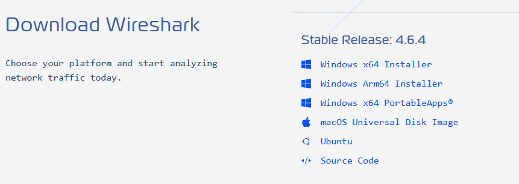
2. Buka file yang sudah didownload untuk lanjut instalasi, ikuti seperti gambar dibawah.
Langkah 1,
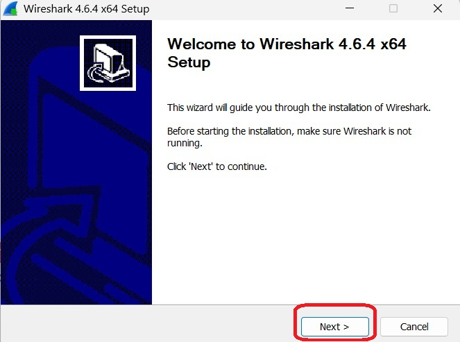
Langkah 2,
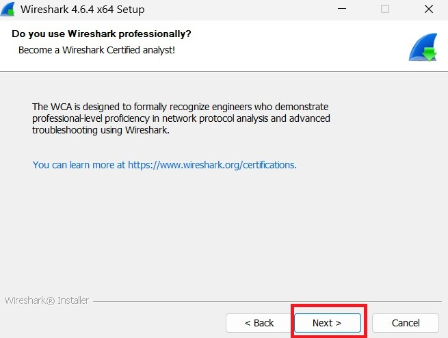
Langkah 3,
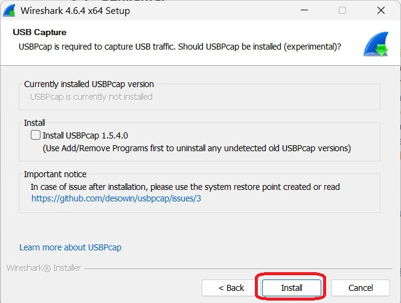
Langkah 4,
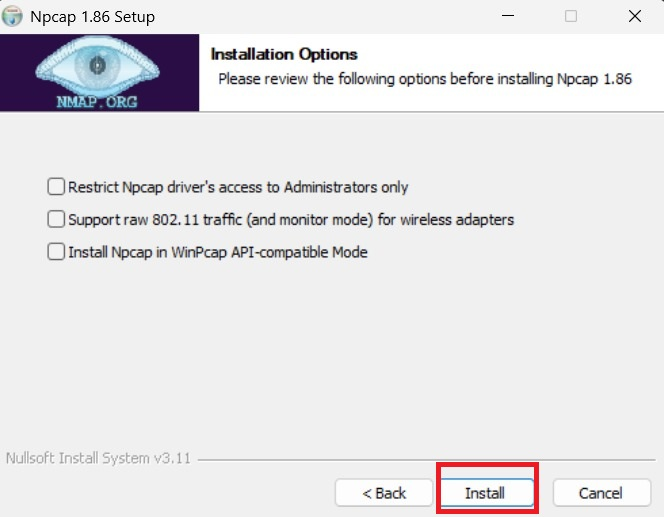
Langkah 5,
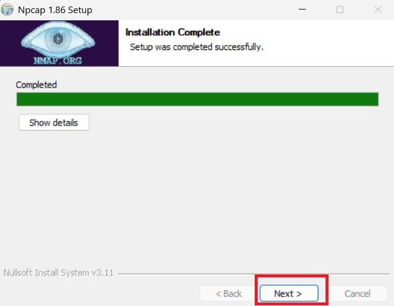
Langkah 6,
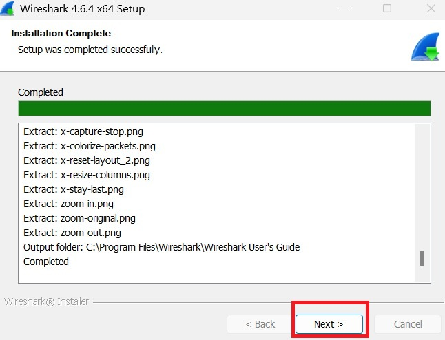
Langkah 7.
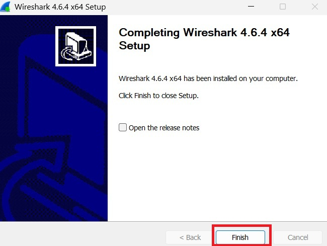

Setelah finish maka Wireshark sudah dapat digunakan.

---
#### 2.2 Langkah Menjalankan Wireshark 
Wireshark adalah software yang digunakan untuk menganalisis lalu lintas jaringan (network traffic) secara detail. Dengan Wireshark, kita bisa melihat paket data yang dikirim dan diterima dalam sebuah jaringan secara real-time.
1. Buka aplikasi Wireshark yang sudah didownload.
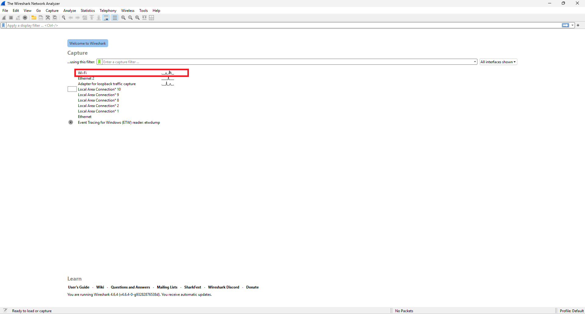
2. Pada tampilan awal aplikasi terdapat fitur capture yang digunakan untuk menangkap (capture) paket data yang lewat pada suatu jaringan secara langsung.Data yang tertangkap akan ditampilkan dalam bentuk paket-paket jaringan yang berisi informasi seperti alamat IP sumber dan tujuan, protokol yang digunakan, serta isi komunikasi data. **Pilih wifi dengan klik dua kali seperti pada gambar di atas untuk melanjutkan percobaan**.
3. Maka akan muncul tampilan seperti gambar dibawah.
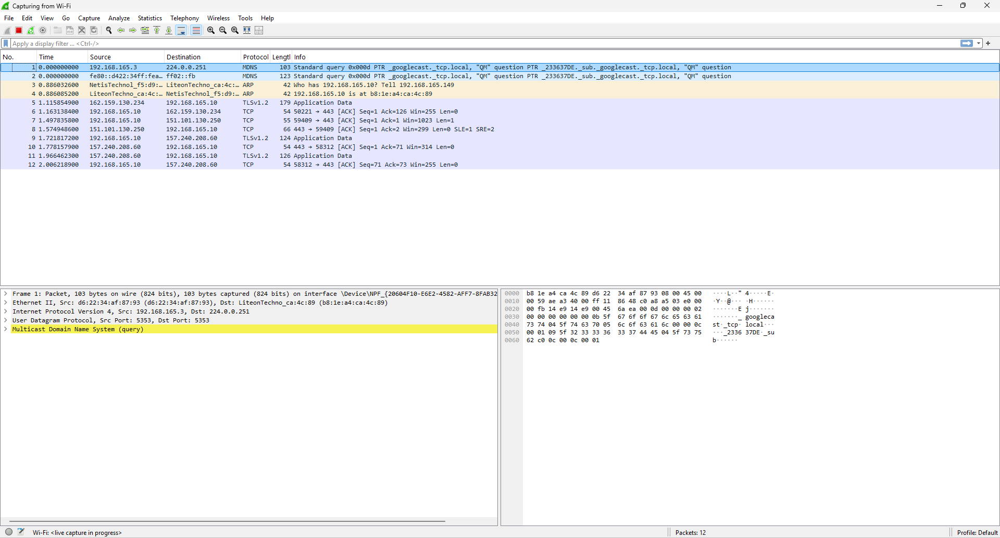
4. Buka browser kalian lalu masukkan link berikut agar dapat terdeteksi oleh Wireshark.
http://gaia.cs.umass.edu/wireshark-labs/INTRO-wireshark-file1.html
**Note Penting**: 
1.Pastikan saat di browser link kalian tidak auto correct dari HTTP menjadi HTTPS karena tidak akan terdeteksi,
2.Refresh browser secara berkala bila tidak terdeteksi oleh Wireshark.
5. Kembali ke aplikasi Wireshark kalian lalu ketikkan **http** pada kolom filter seperti gambar dibawah
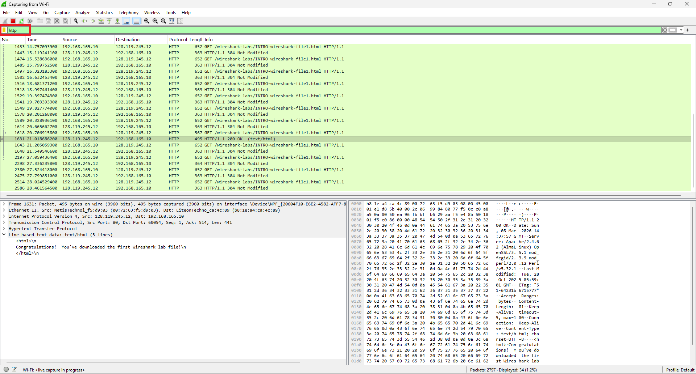
6. Kemudian kalian bisa cari info pada hasil filter yang muncul yang bertuliskan **HTTP/1.1 200 OK  (text/html)**. seperti gambar dibawah untuk lihat hasil dari capture wireshark.
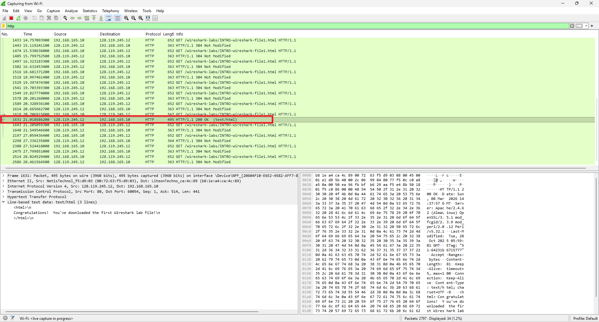
7. Kemudian kalian bisa pencet tanda panah kesamping (>) pada bagian kiri bawah yang bertuliskan **Line-based text data: text/html** sehingga akan muncul tulisan **Congratulations! You've downloaded the first Wireshark lab file!\n** seperti gambar dibawah
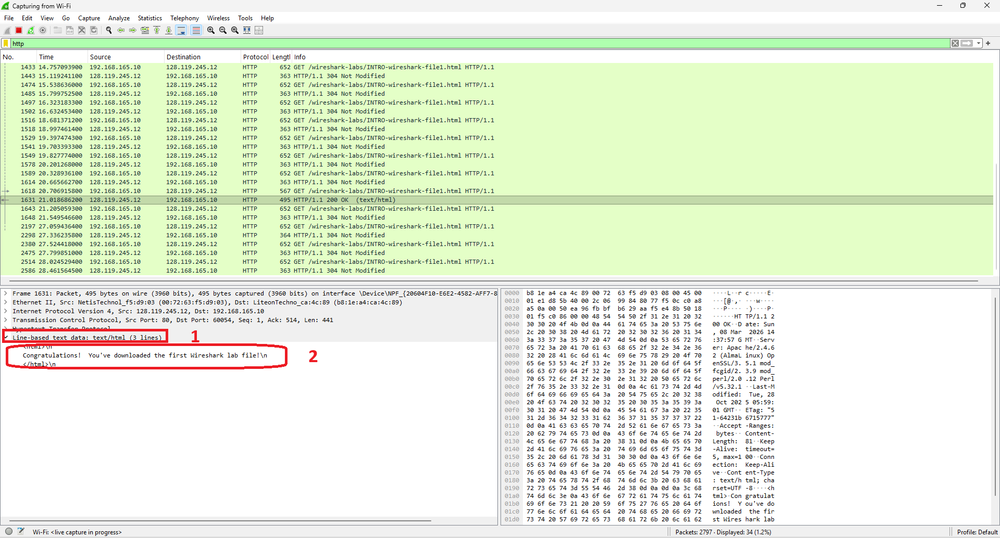

8. Maka dengan ini praktikum telah selesai

#### 7. Kesimpulan
Wireshark dapat digunakan untuk menangkap paket data jaringan pada komputer. Saya dapat melihat berbagai informasi paket jaringan melalui Wireshark yang mendeteksi dari jaringan saya.