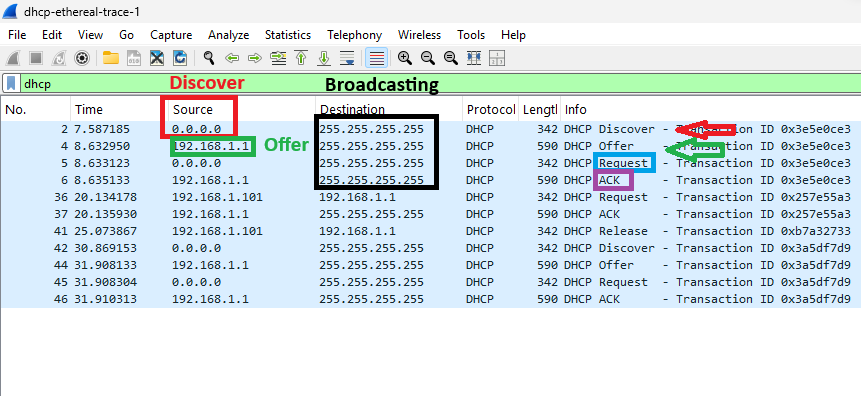

#  Laporan Praktikum Modul 11 DHCP (Dynamic Host Configuration Protocol)
Nur Ro'yul Amin 103072400159 

---

## Tujuan Praktikum
1. Memahami konsep DHCP
2. Menganalisis paket DHCP menggunakan Wireshark
3. Mengidentifikasi proses DHCP Discover, Offer, Request, dan ACK (DORA)

---

Dalam konteks jaringan setiap perangkat membutuhkan alamat IP agar dapat saling berkomunikasi atau terhubung. Pada contoh dunia nyata misal ingin menyambung pada wifi cafe atau warkop Konfigurasi IP secara manual (tanya gateway, IP dan lain-lain) kurang efisien dan tentunya tidak mungkin karena akan ribet pada pemilik wifi nya, sehingga digunakan DHCP untuk memberikan alamat IP secara otomatis dan pelanggan hanya perlu memasukkan password.

**Apa itu DHCP?**

DHCP (Dynamic Host Configuration Protocol) adalah protokol jaringan yang digunakan untuk memberikan konfigurasi IP secara otomatis kepada client dalam jaringan. Konfigurasinya itu meliputi IP Address, Subnet Mask, Gateway, Default DNS jadi tanpa DHCP maka pelanggan / user harus konfigurasi sendiri.

**DHCP Release**
DHCP Release adalah proses ketika client melepaskan IP Address yang sedang digunakan kepada DHCP Server. Jadi IP Address pada client akan di lepas lalu IP address tersebut bisa digunakan oleh client yang lain.

**DHCP Renew**
DHCP Renew adalah proses memperbarui atau meminta kembali alamat IP kepada DHCP Server

---
Berikut analisis hasil capture yang disediakan oleh Modul (dhcp-etheral-trace-1) seperti yang ada pada folder ini dan bisa didownload untuk cek sendiri.

**Penjelasan**

**Kotak Hitam:** Alamat IP 255.255.255.255 adalah alamat broadcast yang digunakan untuk mengirim paket ke seluruh perangkat dalam jaringan lokal karena client tidak tahu lokasi DHCP 

**Kotak Merah:** Client mencari DHCP Server dengan mengirim broadcast (255.255.255.255)

**Kotak Hijau:** DHCP Server merespon dengan menawarkan alamat IP, di gambar DHCP (192.168.1.1 menawarkan IP Address 192.168.1.101)

**Kotak Biru:** Client memilih/menerima IP yang ditawarkan lalu meminta  menggunakan IP tersebut

**Kotak Ungu:** ACK, Berarti server setuju permintaan client dan IP resmi diberikan dan bukti bahwa client adalah member 