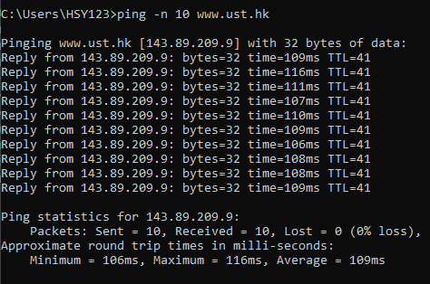
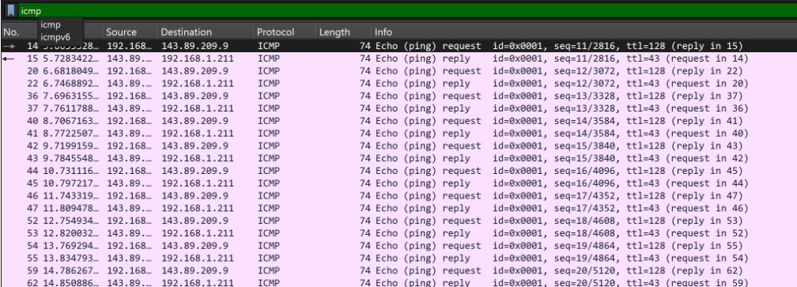
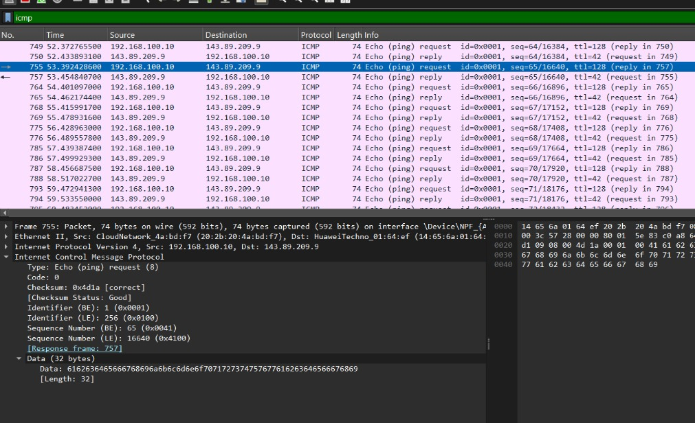
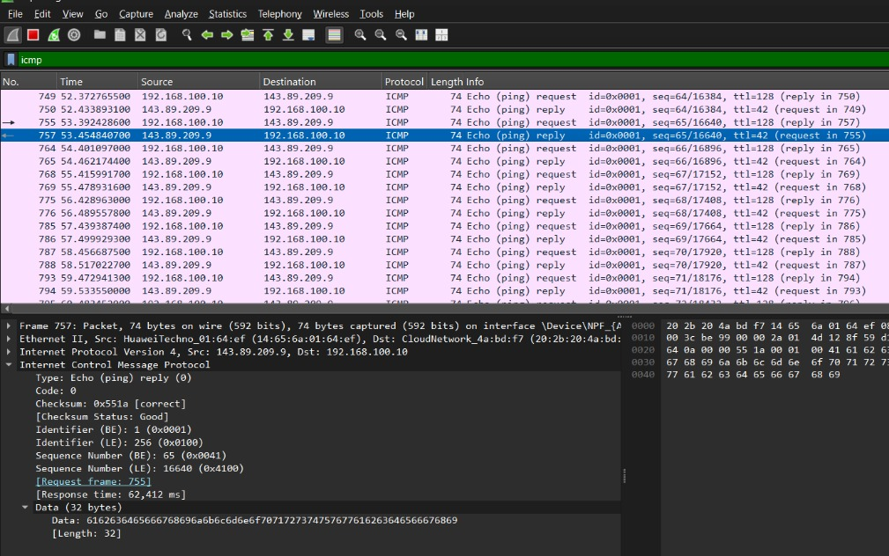
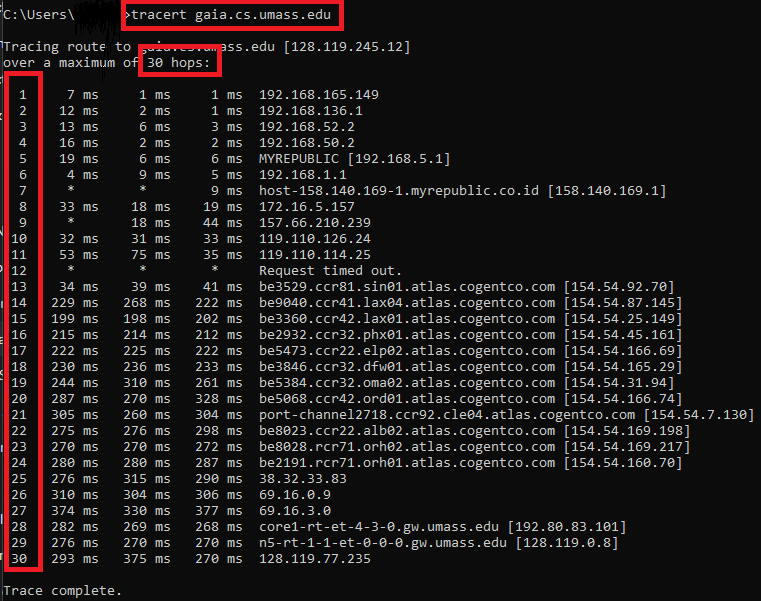
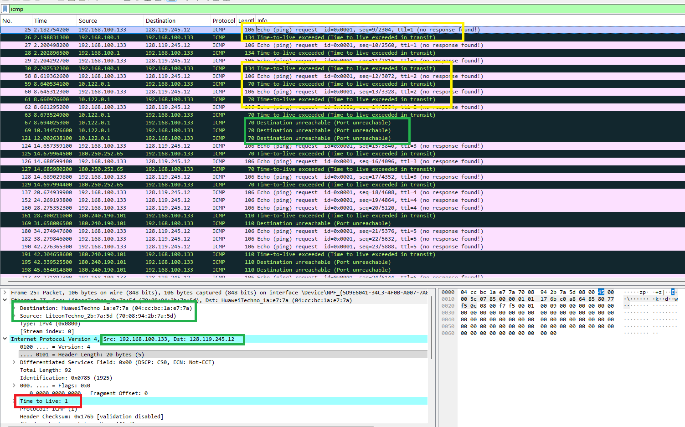
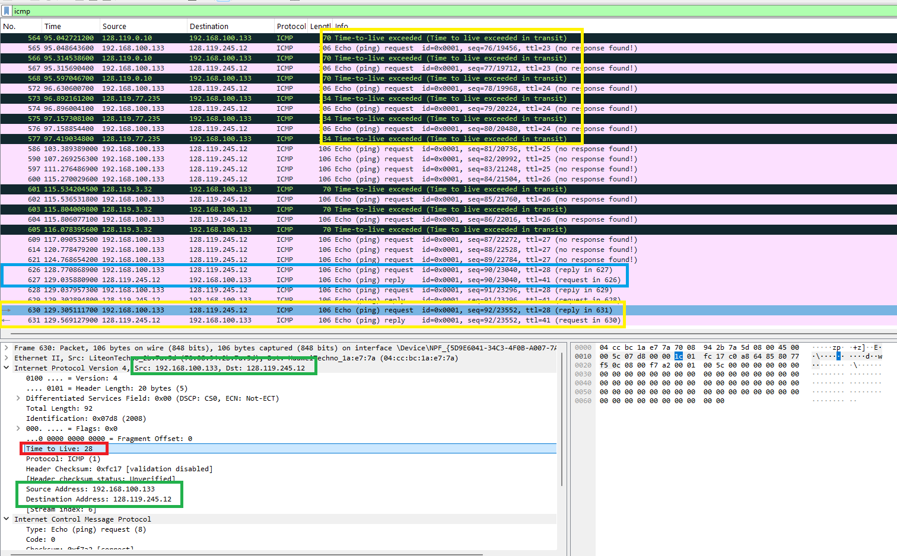
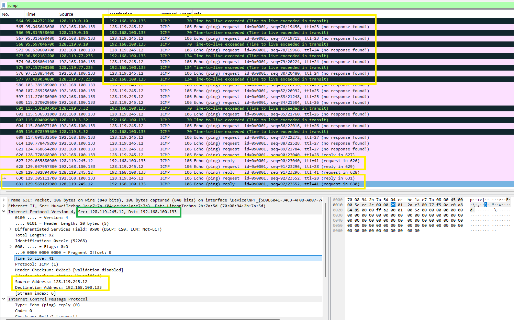

#  Laporan Praktikum Modul 12 ICMP 
Nur Ro'yul Amin 103072400159 

---
### ICMP dan PING
Ping adalah utilitas jaringan yang digunakan untuk menguji apakah sebuah perangkat (seperti komputer, server, atau router) terhubung ke jaringan dan dapat dijangkau. ping bekerja seperti sistem sonar kapal selam: perangkat Anda mengirimkan sinyal, lalu menunggu sinyal tersebut memantul kembali.

Berikut Implementasinya untuk ICMP dan PING
Pertama kita bisa ketikkan  `ping -n 10 www.ust.hk` ke cmd kalian dan ini adalah hasilnya

Kemudian masuk ke Wirehark dan begini adalah tampilannya

Dari tangkapan layar diatas, ada 20 paket, karena kiat menggunakan perintah -n 10 yaitu perintah agar laptop mengirim kan paket sebanyak 10 kali, yang dimana 1 paket terdiri dari request dan reply, selanjutnya cek pesan request.

Terlihat aktivitas protokol ICMP berupa pesan Type 8 Code 0 (Echo ping request) yang dikirim oleh host menuju server tujuan. Paket permintaan ini membawa payload data sebesar 32 bytes. Selanjutnya kita cek pesan Reply.

Diterima paket balasan berjenis Type 0 Code 0 (Echo ping reply) yang diteruskan oleh server kembali kepada host. Respons ini merespons langsung permintaan dari Frame 755, dengan catatan waktu respons (Response time) mencapai 62.412 ms. Server membalas dengan payload data yang serupa yakni 32 bytes, hal ini mengindikasikan bahwa paket sukses melakukan perjalanan pergi-pulang menembus sejumlah hop di jalur internet tanpa menderita packet loss sedikit pun. Jadi bisa dibilang bahwa berhasil terhubung

---
### Tracert atau Traceroute Dan ICMP
Tracert (Traceroute) adalah utilitas jaringan yang digunakan untuk mengetahui jalur yang dilewati paket data dari komputer pengirim menuju host tujuan. Tracert bekerja dengan memanfaatkan nilai TTL (Time To Live) pada paket IP.

Ketika nilai TTL habis di suatu router, router tersebut akan mengirimkan pesan ICMP Time Exceeded kepada pengirim. Dengan cara tersebut, tracert dapat menampilkan daftar router yang dilewati paket hingga mencapai tujuan akhir.

Singktatnya Tracert membantu proses analisis jaringan karena dapat menunjukkan jumlah hop dan waktu tempuh paket menuju tujuan.Pada sistem operasi Windows digunakan perintah tracert, berikut contoh penerapannya:

Pada gambar diatas itu adalah kode dalam CMD yang dapat ditulis `tracert gaia.umass.edu` maka akan melakukan traing sebanyak 30 kali (30 hops) namun ada kalanyya hanya tracing hanya mencapai 28 karena ada kemungkinan router itu tidak memberikan jawaban/response namun pada percobaan saya hops nya lengkap 30.

Kita juga bisa melakukan pembatasan untuk jumlah HOP yang ditampikan dengan ketik pada cmd kalian berikut

#### ICMP
ICMP atau Internet Control Message Protocol adalah protokol pada layer network yang digunakan untuk mengirimkan pesan kontrol, informasi kesalahan, dan diagnostik pada jaringan komputer. ICMP bekerja bersama Internet Protocol (IP) untuk membantu perangkat jaringan mengetahui kondisi pengiriman paket data.

ICMP tidak digunakan untuk mengirim data utama pengguna seperti file atau pesan, melainkan digunakan untuk memberikan informasi terkait proses komunikasi jaringan.

Fungsi ICMP biasanya untuk melakukan Ping, Kirim pesan balasan dan kondisi jaringan kalau terjadi eror saat mengirim pesan dan lain-lain.

Berikut adalah prakktik analisis pada wireshark:

= = = = = = = = = = = = =  = = =  = = = = Pemisah = = = = = = = =  = = = =  = = = = = = = = = =

= = = = = = = = = = = = =  = = =  = = = = Pemisah = = = = = = = =  = = = =  = = = = = = = = = =

= = = = = = = = = = = = =  = = =  = = = = Pemisah = = = = = = = =  = = = =  = = = = = = = = = =
Pada hasil praktik pada Wireshark, proses traceroute bekerja dengan mengirim paket ICMP Echo Request menggunakan nilai TTL (Time To Live) yang meningkat secara bertahap mulai dari TTL = 1, TTL = 2, TTL = 3, dan seterusnya. Nilai TTL berfungsi sebagai batas jumlah hop atau router yang dapat dilewati paket di jaringan. Setiap router yang dilewati akan mengurangi nilai TTL sebesar satu. Ketika nilai TTL mencapai nol, router akan membuang paket tersebut dan mengirimkan pesan ICMP Time Exceeded kepada host pengirim. Pada gambar pertama terlihat bahwa TTL nya itu 1 karena tracert pada cmd itu baru kirim request pertama sedangkan pada gambar kedua menunjukkan bahwa TTL sekarang itu 28 artinya sudah sudah mengirim ke 28 kali, maksimal hops sendiri 30 namun ada router yang tidak kirim response jadi hanya tertampil 28 dan pada TTL 28 ini didapatkan lah response yang terlihat pada hambar ketiga

Pada hasil capture terlihat penggunaan protokol ICMP (Internet Control Message Protocol) yang digunakan untuk fungsi diagnostik jaringan seperti ping dan traceroute. Paket dikirim dari source address 192.168.100.133 menuju destination address 128.119.245.12. Selain pesan Time Exceeded, pada beberapa paket juga muncul pesan “Destination Unreachable (Port Unreachable)” yang menunjukkan bahwa paket telah berhasil mencapai host tujuan, namun port tujuan yang digunakan tidak tersedia atau tidak terbuka. Hal ini menandakan bahwa proses traceroute telah mencapai tujuan akhir.

---