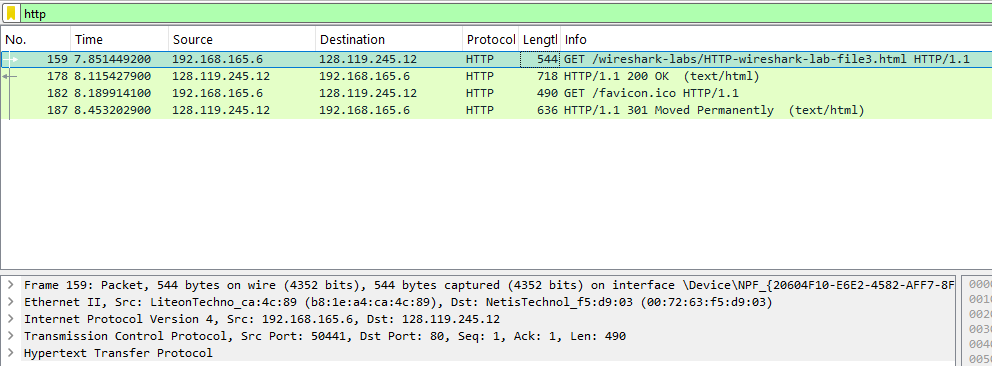
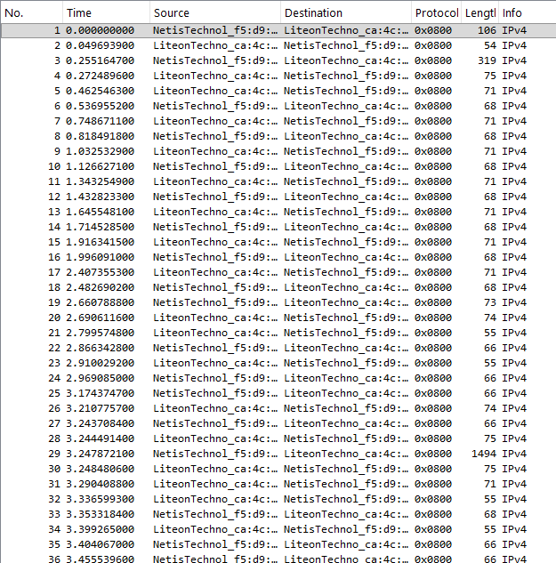
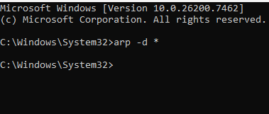
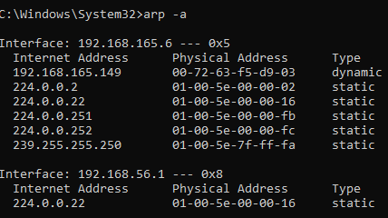
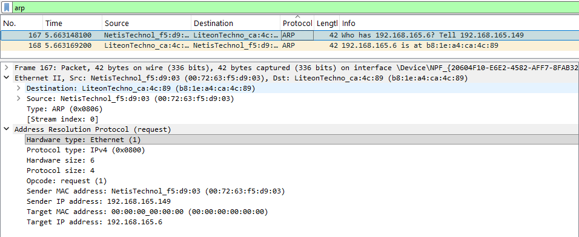

#  Laporan Praktikum Modul 13 Ethernet dan ARP
Nur Ro'yul Amin 103072400159 

---
#### Analisis Frame Ethernet
##### 1. Untuk memulai, langkah pertama yang diperlukan adalah menghapus cache ARP:
1. Kira bersihkan chace browser kita disini saya a=pakai microsoft edge saya bisa klik `Ctrl + Shift + Delete`

##### 2. Nyalakan wireshark
##### 3. Masuk ke link berikut `http://gaia.cs.umass.edu/wireshark-labs/HTTP-wireshark-lab-file3.html`
##### 4. masukkan filter http untuk awalan seperti digambar bawah

##### 5. Karena fokus praktikum kali ini adalah Ethernet dan ARP (bukan IP atau protokol di atasnya), kita perlu menyaring tampilan paket agar hanya menunjukkan protokol di bawah IP. Berikut caranya:

- Pilih menu Analyze -> Enabled Protocols.
- Hapus tanda centang pada kotak IPv4.
- Klik OK.

Setelah langkah ini, Wireshark hanya akan menampilkan informasi terkait frame Ethernet saja.

##### 6. Selanjut setelah ubah settingannya maka tampilannya akan seperti ini

#### ARP (Address Resolution Protocol)
Caching ARP (Address Resolution Protocol Caching) adalah berfungsi untuk menyimpan sementara hasil pemetaan antara alamat IP dan alamat MAC yang telah diperoleh melalui proses ARP di dalam memori lokal sebuah perangkat (seperti komputer, router, atau switch).

##### 1. Untuk memulai langkah awal ARP kita harus buka cmd as administrator dan ketikkan `arp -d *` untuk hapus chache arp kita seperti gambar dibawah

Jika tidak dihapus mungkin akan ada tulisannya, jika ingin cek bisa ketikkan `arp -a`contohnya seperti dibawah

##### 2. Selanjutnya kita bisa ulangi langkah seperti pada pengecekan ethernet yaitu:
- Kosongkan ARP
- Kosongkan browser anda
- buka wireshark dan mulai capture
- masuk ke link berikut `http://gaia.cs.umass.edu/wireshark-labs/HTTP-wireshark-lab-file3.html`
- hentikan capture dan ketikkan filter `arp` maka hasilnya seperti dibawah ini

Pada hasil capture, dua frame pertama dalam jejak biasanya berisi pesan ARP, yaitu ARP Request yang disiarkan (broadcast) oleh komputer pengirim untuk mencari alamat MAC tujuan, diikuti oleh ARP Reply dari komputer yang memiliki alamat IP tersebut.

