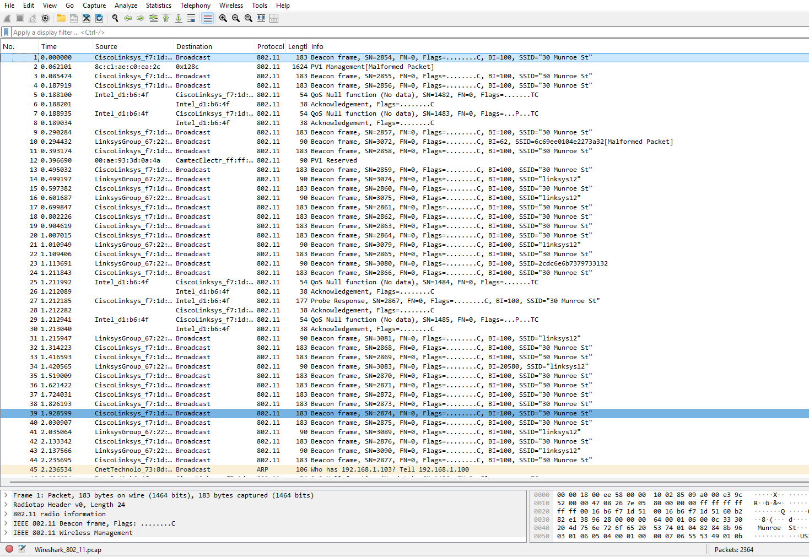
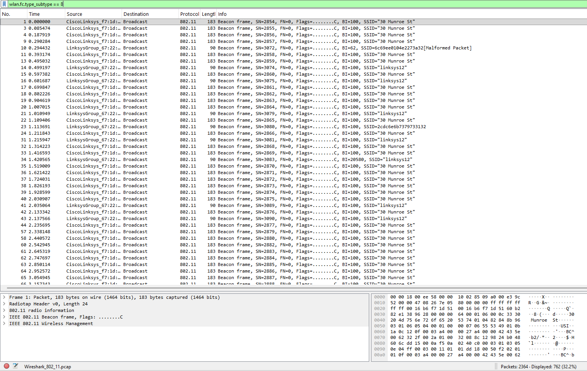
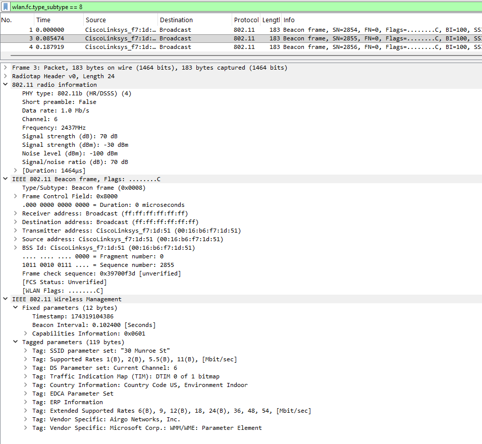
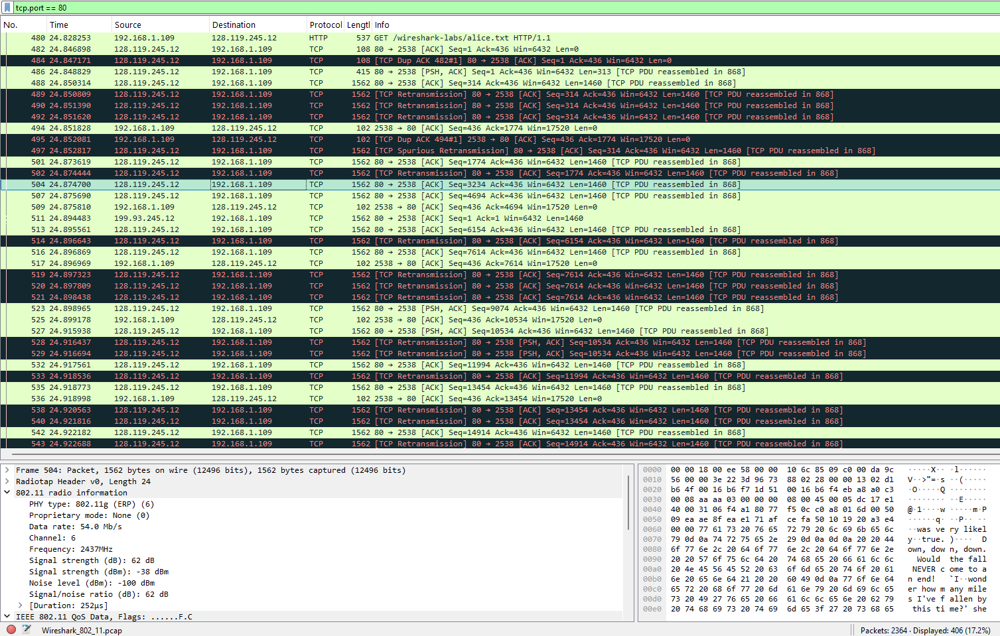
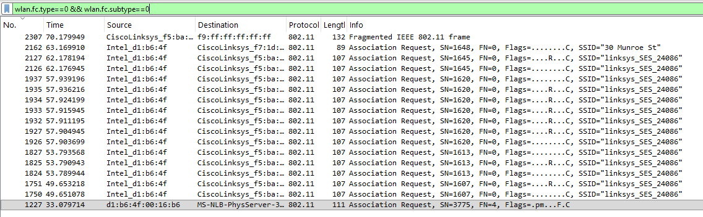
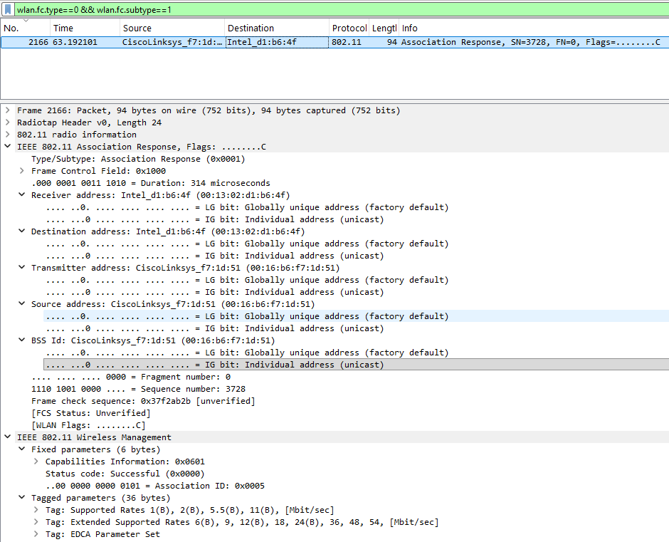
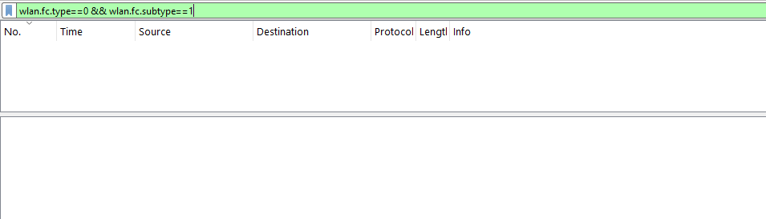

#  Laporan Praktikum Modul 14 802.11 Wifi
Nur Ro'yul Amin 103072400159 

---
Wireless Fidelity (WiFi) merupakan teknologi jaringan nirkabel yang menggunakan standar IEEE 802.11 untuk memungkinkan perangkat berkomunikasi tanpa menggunakan media kabel. Dalam jaringan WiFi, komunikasi dilakukan melalui berbagai jenis frame, seperti beacon frame, data frame, serta frame asosiasi dan disasosiasi yang berfungsi untuk mengatur proses koneksi antara perangkat pengguna dan access point. Pada praktikum kali ini, kita akan melakukan analisis terhadap paket-paket data yang melintas pada jaringan nirkabel (Wi-Fi) dengan standar 802.11. Dalam kondisi normal, untuk dapat menangkap paket-paket jaringan Wi-Fi secara utuh (seperti paket Beacon frame atau Probe Request), kartu jaringan nirkabel (wireless network adapter) pada komputer kita harus mendukung dan berada dalam mode khusus yang disebut Monitor Mode.

Namun, karena sebagian besar kartu jaringan standar pada komputer (khususnya di OS Windows) tidak mendukung pengaktifan Monitor Mode secara mudah, kita tidak dapat melakukan capture atau merekam lalu lintas Wi-Fi kita sendiri. Sebagai solusinya, kita akan menggunakan file rekaman paket jaringan (packet trace) berekstensi .pcap yang sudah dibuat oleh pihak telkom yang saya sediakan dalam direktori ini juga

jadi mari kita muai praktikum ini:
##### 1. Pertama unduh file Wireshark_802_11.pcap yang ada pada direktori ini
##### 2. Buka file pcap tersebut dan ini adalah tampilan awalnya

---
#### Beacon Frame
Beacon Frame merupakan frame manajemen pada protokol IEEE 802.11 yang dikirim secara berkala oleh Access Point (AP) untuk mengumumkan keberadaannya kepada perangkat di sekitarnya. Frame ini berisi informasi penting mengenai jaringan WiFi, seperti SSID (nama jaringan), channel yang digunakan, kemampuan jaringan, dan parameter lainnya yang diperlukan perangkat sebelum melakukan koneksi. Dengan adanya Beacon Frame, perangkat dapat mendeteksi jaringan WiFi yang tersedia dan melakukan proses asosiasi dengan Access Point yang dipilih.

Untuk melihat wujud asli dari paket pengumuman ini, kita dapat melakukan penyaringan (filtering) pada Wireshark.

Gunakan filter `wlan.fc.type_subtype == 8` untuk menampilkan Beacon Frames nya da hasilnya seperti gambar dibawah

Selanjutnya kita bisa pilih salah satu dari paket tracenya disini saya pilih yang nomor 3

Berikut kira kira adalah hal yang bisa dihightlight
1. Pada kolom Source, terlihat pengirimnya adalah sebuah AP pabrikan Cisco/Linksys dengan alamat Hardware/MAC Address 00:16:b6:f7:1d:51.

2. Pada kolom Destination, tujuannya adalah Broadcast (ditandai dengan alamat fisik ff:ff:ff:ff:ff:ff). Ini membuktikan prinsip dasar bahwa AP menyiarkan informasi jaringannya secara terbuka ke semua perangkat nirkabel yang ada di sekitarnya.

3. Nama Jaringan WiFi (SSID): Di dalam rincian IEEE 802.11 Wireless Management pada Tagged parameters, terdapat informasi Tag: SSID parameter set: "30 Munroe St". Ini menunjukkan bahwa Service Set Identifier (SSID) atau nama WiFi yang akan muncul di perangkat klien saat melakukan scan WiFi adalah "30 Munroe St".

4. Kanal dan Frekuensi Jaringan: AP ini memancarkan sinyalnya pada Channel 6 dengan rentang frekuensi 2437 MHz. Informasi ini dikonfirmasi ganda, baik di dalam radio information maupun pada Tag: DS Parameter set.

5. Interval Pemancaran (Beacon Interval): Terdapat nilai Beacon Interval sebesar 0.102400 Seconds. Artinya, AP tersebut mengirimkan paket Beacon ini secara rutin setiap ~102,4 milidetik untuk memastikan perangkat baru yang masuk ke area jangkauannya bisa segera mendeteksi keberadaan jaringan "30 Munroe St".

6. Identitas Jaringan Fisik (BSSID): Nilai BSS Id yang tercatat adalah 00:16:b6:f7:1d:51. BSSID berfungsi sebagai pengidentifikasi unik untuk jaringan nirkabel ini dan nilainya identik dengan alamat MAC dari Access Point pemancar.

---
#### Data Transfer
Setelah perangkat kita mengenali router dari pesan Beacon Frames dan berhasil terhubung, tahap selanjutnya adalah proses komunikasi yang sesungguhnya. Dalam jaringan Wi-Fi, segala aktivitas kita seperti memuat halaman web, menonton video, atau mengirim pesan, dibawa oleh jenis paket yang disebut Data Frames, disini kita akan lihat langsung data asli (payload) dari yang dilakuka pengguna ini

Gunakan filter `tcp.port == 80` untuk menampilkan paket HTTPnya dan berikut adalah hasilnya\

Disini saya akan memilih salah satu hasil capture untuk dianalisis, saya memilih nomor 1254

dan ini adalah analisisnya
- Protokol Tautan Nirkabel (IEEE 802.11 Data Frame): Protokol 802.11 beroperasi secara spesifik sebagai protokol lapisan tautan nirkabel (wireless link-layer). Transmisi Data Frame di sini menggunakan manajemen MAC Address yang kompleks (mencakup Source, Destination, Transmitter, dan Receiver) untuk memastikan sinyal radio terarah dengan tepat antara host klien dan Access Point (AP).  
- Penerjemah Standar Jaringan (Logical-Link Control / LLC): Lapisan LLC bertindak sebagai jembatan yang membungkus paket internet agar selaras dengan format radio 802.11. Hal ini memungkinkan paket data nirkabel diteruskan dengan mulus ke infrastruktur jaringan internet kabel yang standar.
- Keandalan Transportasi Data (IPv4 & TCP): Di dalam bungkus nirkabel tersebut, tersembunyi datagram IPv4 yang membawa segmen TCP. Protokol TCP bertugas menyediakan layanan pengiriman data yang andal dan menjamin bahwa setiap byte informasi tiba di tujuan secara berurutan tanpa ada yang terlewat atau rusak.
- Muatan Aplikasi Target (HTTP Transfer): Lapisan tertinggi pada paket ini membawa eksekusi langsung dari aplikasi jaringan, seperti proses host yang melakukan interaksi permintaan HTTP dan menerima respons (misalnya saat mengambil dokumen teks atau mengunduh gambar dari server).\

---
#### Association / Disassociation
Association merupakan proses ketika sebuah host atau perangkat klien meminta izin untuk bergabung dengan suatu Access Point (AP), sedangkan Disassociation merupakan proses pemutusan hubungan antara host dan Access Point. Dalam protokol IEEE 802.11, proses association dilakukan menggunakan frame Association Request dan Association Response yang termasuk ke dalam kategori management frame.

Untuk menganalisis proses Association, gunakan filter `wlan.fc.type==0 && wlan.fc.subtype==0`(Subtype 0 merujuk pada Association Request) dan hasilnya seperti pada gambar di bawah ini:

dari gambar diatas ini bisa dilihat beberapa Association Frame reuqest yang di kirimkan ke Access Point dengan SSID 'linksys_SES_24086'.Ini menunjukkan bahwa host melakukan beberapa kali percobaan untuk terhubung dengan jaringan itu.

Kemudian gunakan filter `wlan.fc.type==0 && wlan.fc.subtype==1` untuk menampilkan Association Response, hasilnya dibwah ini

Association Response adalah pesan balasan yang dikirim oleh Access Point kepada host yang meminta koneksi. Pesan ini berisi informasi status koneksi, seperti status keberhasilan koneksi, mode jaringan yang digunakan dan pada gambar di atas ada 1 response yang menandakan bahwa pengguna telah terhubung.

Kemudain yang terakhir gunakan filter `wlan.fc.type==0 && wlan.fc.subtype==10` untuk menampilkan Disassociation dan hasilnya dibawah ini

disini terlihat bahwa tidak ditemukan tangkapan paket host melakukan disassociation dengan access point selama proses perekaman berlangsung.