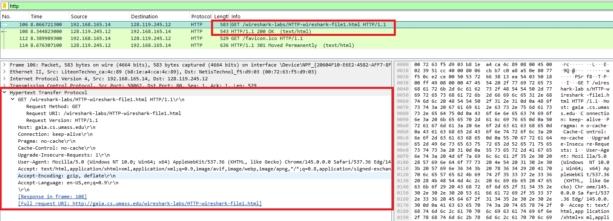
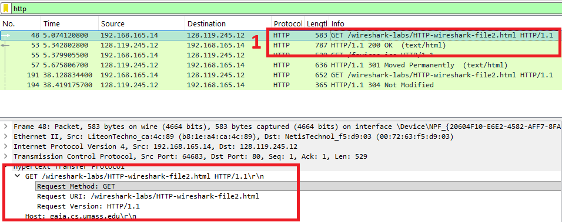
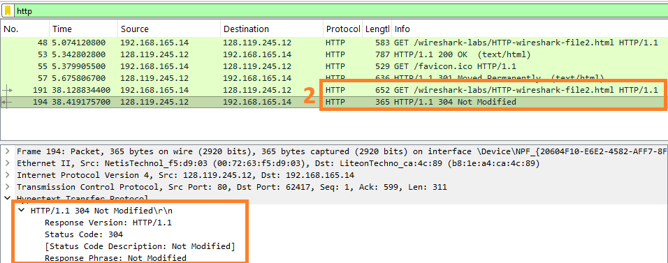
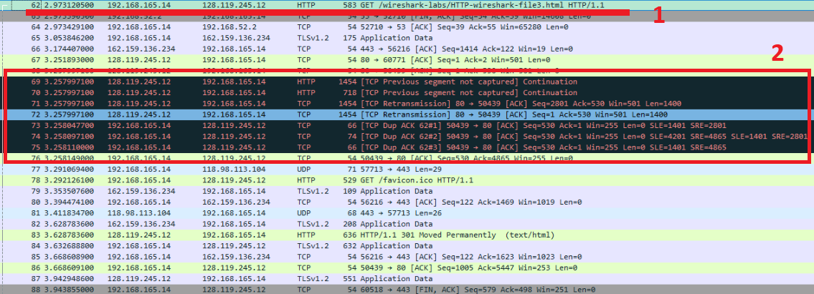
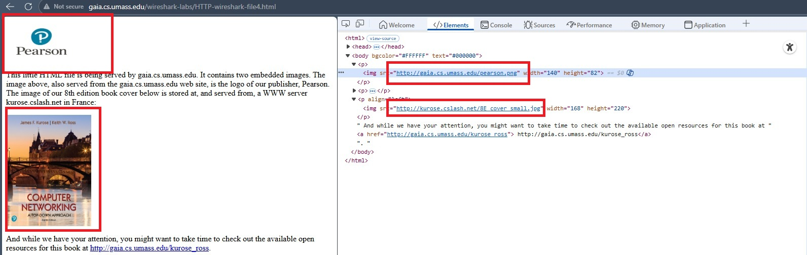
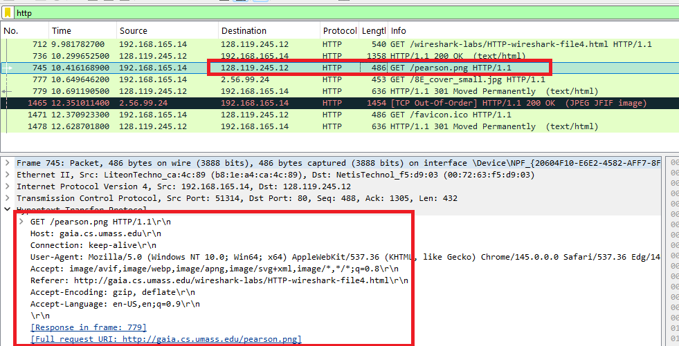
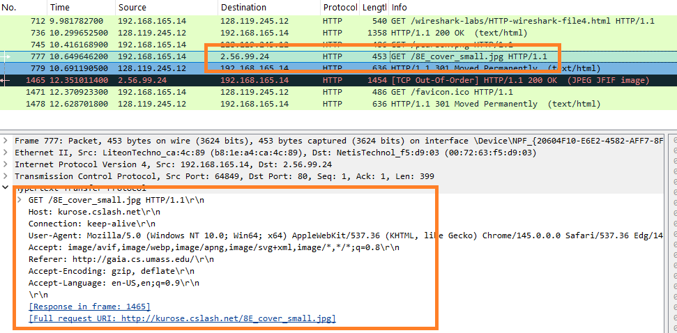
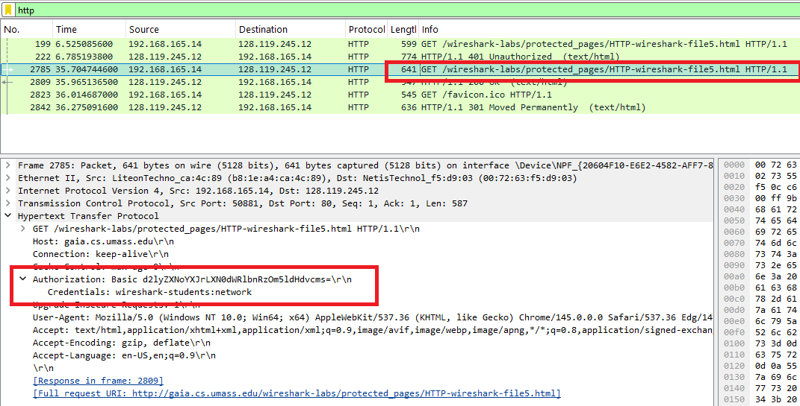

#  Laporan Praktikum Modul 3
Nur Ro'yul Amin 103072400159 

---
#### 1.1 Tujuan Praktikum
1. Memahami Cara Kerja Protokol HTTP,
2. Mengamati proses komunikasi HTTP antara client dan server.

---
#### 1.2 Alat Yang Digunakan
1. Wireshark

---
#### 2.1 Penjelasan
Pada praktikum ini kita melakukan pengamatan bagaimana konsep protokol dari HTTP menggunakan Wireshark. HTTP (Hypertext Transfer Protocol) merupakan protokol yang digunakan untuk pertukaran informasi antara client dan server pada web dengan cara request dan response. Dalam proses ini, client seperti browser mengirimkan permintaan HTTP kepada server untuk mengambil suatu halaman web atau sumber daya lainnya, kemudian server akan memberikan respons berupa data yang diminta. Untuk mengamati proses ini dapat dilakukan dengan aplikasi Wireshark, yaitu sebuah aplikasi analyzer yang dapat menangkap dan menampilkan paket data yang dikirim dan diterima melalui jaringan sehingga memungkinkan pengguna untuk menganalisis isi serta struktur paket dari berbagai protokol jaringan.

---
#### 2.2 Praktikum
##### 2.2.1 Basic HTTP GET 
Pada praktik ini, kita memakai browser bebas unntuk akses ke link berikut
http://gaia.cs.umass.edu/wireshark-labs/HTTP-wireshark-file1.html, Kemudian kita aktifkan Wireshark untuk menangkap paket yang dikirim melalui jaringan dan filter dengan kata http. Dari hasil tangkapan paket dapat dilihat bahwa browser mengirimkan pesan HTTP GET ke server untuk meminta file HTML, kemudian server memberikan HTTP response yang berisi data halaman tersebut. Melalui Wireshark, mahasiswa dapat melihat detail pesan HTTP yang dikirim dan diterima seperti gambar dibawah.

##### 2.2.2 HTTP Conditional GET
HTTP conditional GET artinya kita wireshark menerima paket itu hanya 1 kali sedangkan selanjutnya akan akses dari cache(pada link yang sama), jadi pada percobaannya kita akan mengakses link berikut http://gaia.cs.umass.edu/wireshark-labs/HTTP-wireshark-file2.html sekali lalu kita refresh pakai refresh di browser yang kita gunakan. Jika file pada server tidak mengalami perubahan sejak terakhir diakses, server tidak akan mengirim ulang seluruh data, tapi hanya memberikan respon bahwa file belum berubah. Dengan menggunakan Wireshark, proses pertukaran pesan HTTP ini dapat diamati untuk memahami bagaimana mekanisme caching bekerja pada komunikasi web. Perhatikan gambar dibawah ini.

pada gambar di atas ini adalah akses ke link di atas untuk pertama kalinya sedangkan pada gambar dibawah ini adalah setelah refresh, terdapat keterangan bahwa file/linknya not modified(tidak ada perubahan) maka diakses dari cache

##### 2.2.3 Retrieving Log Document
Pada praktik ini kita akan analisis bagaimana cara pengambilan dokumen html pada link berikut http://gaia.cs.umass.edu/wireshark-labs/HTTP-wireshark-file3.html, pastikan kalian sudah membersihkan cache browser kalian. Kita akan masuk ke link kemudian buka wireshark dengan filter http menyala, jika sudah menangkap maka tunggu sebentar lalu hentikan wireshark dan hapus filter pencarian. Pada daftar paket kita akan lihat TCP (Transmission Control Protocol) mengirim data html ke kita secara bertahap karena ukuran html yang besar, bisa dilihat pada gambar dibawah.

Pada garis merah nomor 1 adalah kita meminta (GET) ke link di atas, lalu kotak merah ke 2 adalah saat TCP melakukan proses pengiriman. TCP retransmission artinya data mulai dikirim oleh TCP, lalu TCP Dup ACK adalah adata yang dikirim ulang karena data sebelumnya ada yang kurang lengkap.

##### 2.2.4 HTML Documents dengan Embedded Objects
Artinya sebuah HTML dapat memuat beberapa objek selain objek dari HTML itu sendiri seperti gambar atau file lain. Saat browser mengakses sebuah halaman HTML yang punya beberapa objek, browser tidak hanya mengirim satu HTTP request, tetapi akan mengirim beberapa request tambahan untuk mengambil setiap objek tersebut dari server. Dengan Wireshark kita dapat melihat bahwa setiap objek yang diminta menghasilkan paket HTTP GET tersendiri dan server akan memberikan respons untuk masing-masing objek tersebut. Namun pada percobaan kita ini perlu untuk melakukan inspect lalu klik link dari file/data(Gambar) yang ada pada link berikut http://gaia.cs.umass.edu/wireshark-labs/HTTP-wireshark-file4.html, gambar dibawah adalah tampilan web dari link dan juga inspect yang berisi link dari gambar yang perlu kita klik untuk cek.

Dan gambar dibawah ini adalah hasil tangkapan dari wireshark dari gambar pertama(pearson/kotak merah) dan gambar kedua(kurose/kotal oranye).

##### 2.2.5 HTTP Authentication 
Artinya ini adalah autentikasi pada protokol HTTP yang digunakan untuk membatasi akses ke suatu halaman web. Pada praktik ini, ketika client mencoba mengakses halaman yang dilindungi, server merespon dengan permintaan autentikasi sehingga browser meminta pengguna untuk memasukkan username dan password. Setelah itu browser akan mengirimkan kembali request HTTP yang berisi informasi autentikasi pada header Authorization kemudian diubah ke Base64. Kemudian buka Wireshark dan analisis proses pertukaran pesan tersebut sehingga dapat dipahami bagaimana HTTP melakukan proses verifikasi identitas pengguna sebelum memberikan akses ke halaman yang diminta. Berikut adalah link dari web percobaan http://gaia.cs.umass.edu/wireshark-labs/protected_pages/HTTP-wireshark-file5.html dengan username "wireshark-students" dan password "network", jangan lupa hapus cache sebelum mencoba. Dibawah adalah gambar dari hasil praktik.

Tertera pada credential username dan password kita yang menunjukkan bahwa HTTP itu tidak aman.

Sekian Terimakasih.