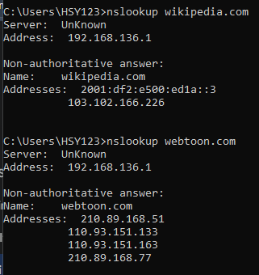
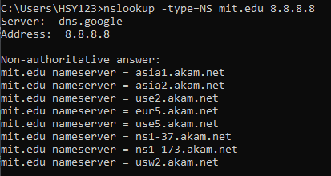
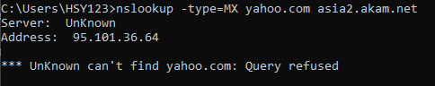
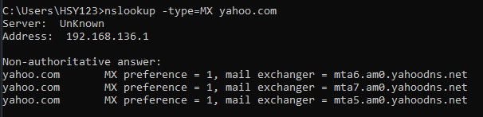
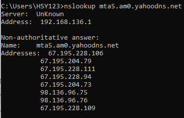

#  Laporan Praktikum Modul 4 Soal 1
Nur Ro'yul Amin 103072400159 IF 04-04

---
### Pertanyaan dan Jawabannya:
__1. Jalankan nslookup untuk mendapatkan alamat IP dari server web di Asia. Berapa alamat IP 
server tersebut?__

__Jawab__: Ketikkan kode berikut pada cmd:
>nslookup webtoon.com

kita akan mendapatkan hasil berikut:

Disini kita mendapatkan 4 alamat ip
* 210.89.168.51
* 110.93.151.133
* 110.93.151.163
* 210.89.168.77

Alasan kenapa alamat ip bisa banyak karena misal jika satu server sedang down atau mengalami gangguan, server lain masih bisa melayani permintaan. Jadi, webtoon tidak akan langsung mati total. Bayangkan jutaan orang buka Webtoon di waktu yang sama. Dengan banyak IP, beban trafik tersebut bisa dibagi-bagi ke beberapa server supaya tidak ada satu pun server yang keberatan beban (overload).

__2. Jalankan nslookup agar dapat mengetahui server DNS otoritatif untuk universitas di Eropa.__

__Jawab__: Coba ketikkan query ini pada cmd:
>nslookup -type=NS mit.edu 8.8.8.8

maka akan keluar hasil seperti ini:

__3. Jalankan nslookup untuk mencari tahu informasi mengenai server email dari Yahoo! Mail melalui salah satu server yang didapatkan di pertanyaan nomor 2. Apa alamat IP-nya?__

__Jawab__: Kita coba cari server mail dari Yahoo dengan nameserver yang udah kita dapatkan dari nomor 2, coba ketikkan kode berikut:
>nslookup -type=MX yahoo.com asia2.akam.net
(mx digunakan untuk cari server mana yang digunakan untuk terima mail)

ternyata muncul hasil ini:

Pada percobaan ini perintah nslookup MX menggunakan server DNS asia2.akam.net hasilnya error “Query refused”. Ini menunjukkan bahwa server DNS menolak permintaan query yang diberikan. Kemungkinan penyebabnya adalah server tersebut tidak mengizinkan query publik atau hanya melayani domain tertentu saja. Oleh karena itu, server DNS tersebut tidak bisa digunakan untuk memperoleh informasi mail server dari domain yahoo.com.

Karena tidak bisa jika pakai DNS server mit kita langsung saja tanpa hal itu, ketikkan kode berikut:
>nslookup -type=MX yahoo.com

berikut adalah hasilnya

selanjutnya kita coba cek alamat IP dari salah hasil MX nya, disini saya pilih yang mta5 maka ketikkan kode ini:
>nslookup mta5.am0.yahoodns.net

Maka berikut adalah jawabannya
