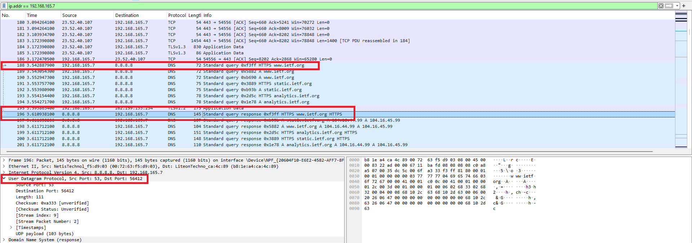
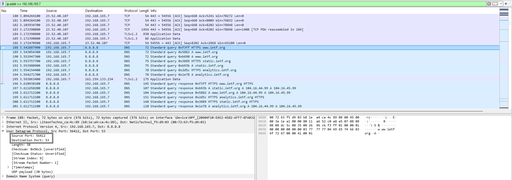
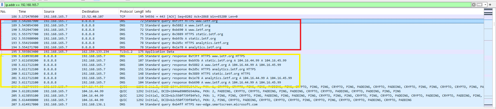
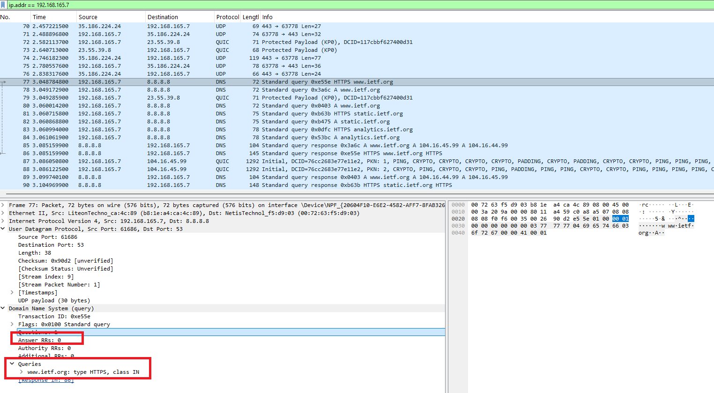
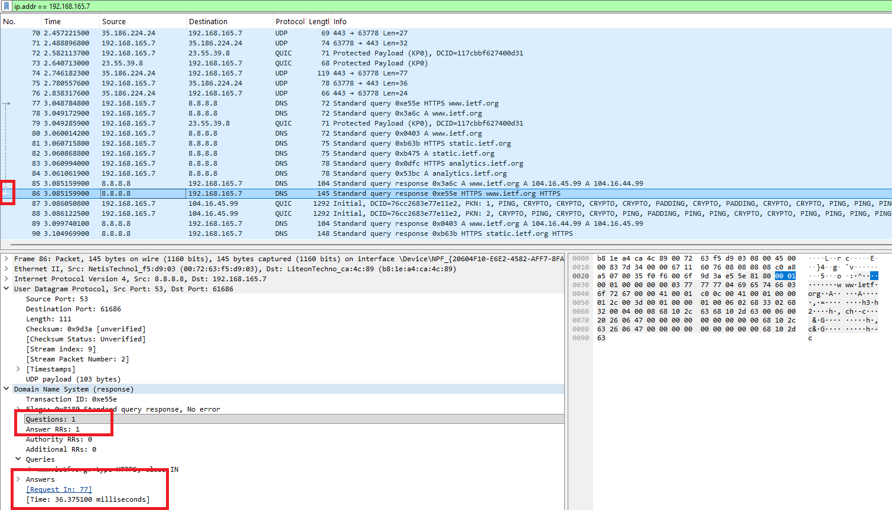
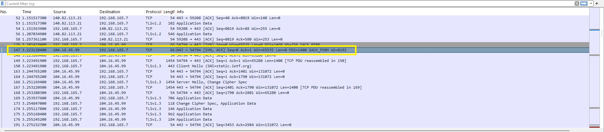
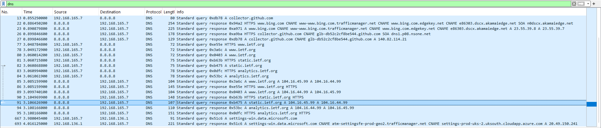
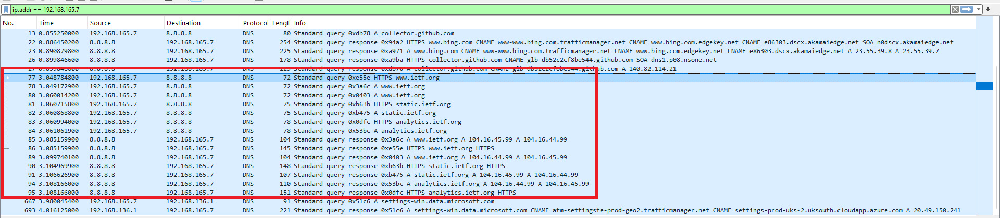

#  Laporan Praktikum Modul 4 Soal 2
Nur Ro'yul Amin 103072400159 IF 04-04

---
### Pertanyaan dan Jawabannya:
__1. Cari pesan permintaan DNS dan balasannya. Apakah pesan tersebut dikirimkan melalui UDP atau TCP?__ 

__Jawab__: Kita harus mencari ip address kita dengan cara buka cmd lalu ketikkan:
> ipconfig

disitu nanti kalian cari ip address kalian (jika wifi) bagian wireless lan adapter dan pilih yang IPv4, kemudian buka wireshark dan mulai capture lalu masukkan pada bagian filter:
>ip.addr == [IPv4 kamu/IP address kamu]

dan masuk ke website `http://www.ietf.org` kemudian stop capture dan berikut hasilnya

bisa dilihat ternyata pesan permintaan DNS dan balasannya menggunakan __UDP__ berdasarkan kotak merah penunjuk.

__2. Apa port tujuan pada pesan permintaan DNS? Apa port sumber pada pesan balasannya?__ 

__Jawab__: Pada gambar dibawah dan penunjuk kotak abu-abu menunjukkan bahwa pada pesan permintaan port tujuannya __53__ sedangkan pada port sumber pada pesan balasannya adalah __53__ juga karena sebenarnya hanya dibalik balik yang ditanyakan

__3. Pada pesan permintaan DNS, apa alamat IP tujuannya? Apa alamat IP server DNS lokal anda (gunakan ipconfig untuk mencari tahu)? Apakah kedua alamat IP tersebut sama?__

__Jawab__: Jika dilihat dari gambar dibawah menunjukkan bahwa destinasi atau alamat IP dari pesan permintaan (8.8.8.8) itu tidak sama dengan IP server DNS lokal saya (192.168.165.7). Kedua alamat IP tersebut tidak sama, sehingga dapat disimpulkan bahwa permintaan DNS tidak dikirim ke DNS lokal, melainkan ke server DNS eksternal. 

__4. Periksa pesan permintaan DNS. Apa “jenis” atau ”type” dari pesan tersebut? Apakah pesan permintaan tersebut mengandung ”jawaban” atau ”answers”?__

__Jawab__: Berdasarkan gambar dibawah answernya itu masih 0 karena ini baru mengirim permintaan kemduian untuk typenya itu HTTPS(menunjukkan parameter koneksi) dan class IN

__5. Periksa pesan balasan DNS. Berapa banyak ”jawaban” atau ”answers” yang terdapat di dalamnya? Apa saja isi yang terkandung dalam setiap jawaban tersebut?__

__Jawab__: Sebenarnya beda request yang di cek beda juga jumlah answer namun untuk gambar dibawah yang saya cek ini mendapatkan 1 answer dan isinya adalah 
[Request In : 77]
[Time : 36.375100 miliseconds]

__6. Perhatikan paket TCP SYN yang selanjutnya dikirimkan oleh host Anda. Apakah alamat IP pada paket tersebut sesuai dengan alamat IP yang tertera pada pesan balasan DNS?__

__Jawab__: Berdasarkan gambar dibawah ini untuk bagian TCP SYN alamat IP nya sebai berikut

dan ini adalah alamat IP untuk balasan DNS yang tadi

maka bisa dilihat bahwa hasil alamat IP nya sama yaitu 192.168.165.7

__7. Halaman web yang sebelumnya anda akses (http://www.ietf.org) memuat beberapa gambar. Apakah host Anda perlu mengirimkan pesan permintaan DNS baru setiap kali ingin mengakses suatu gambar?__

__Jawab__: Jawabanya adalah tidak. Host usah mengirim pesan permintaan DNS yang baru setiap ingin mengakses gambar, umumnya di akses semua sekali diawal, lalu disimpan ke cache lokal dalam masa kadaluarsa tertentu (atau kalau kita menghapusnya secara sengaja).
