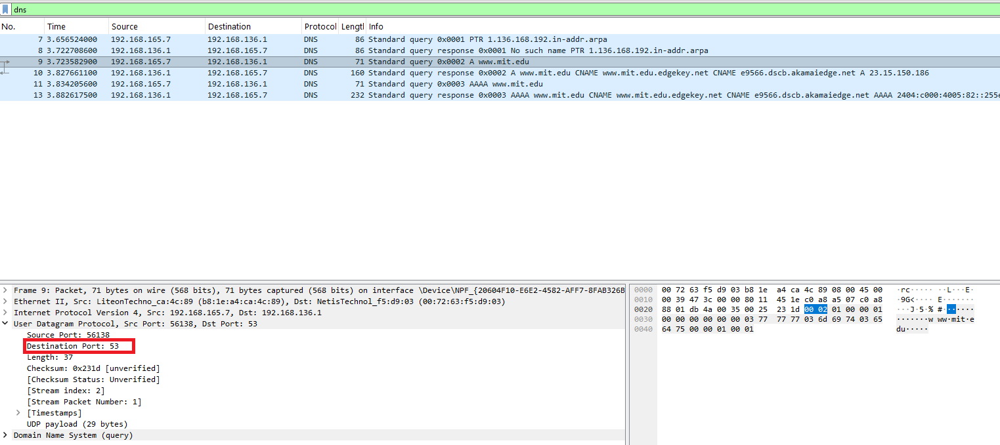
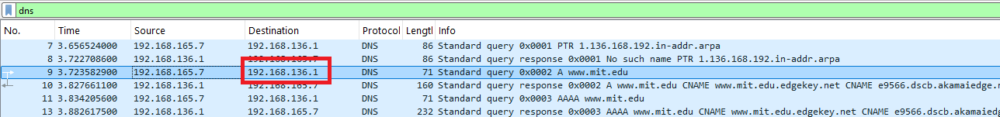
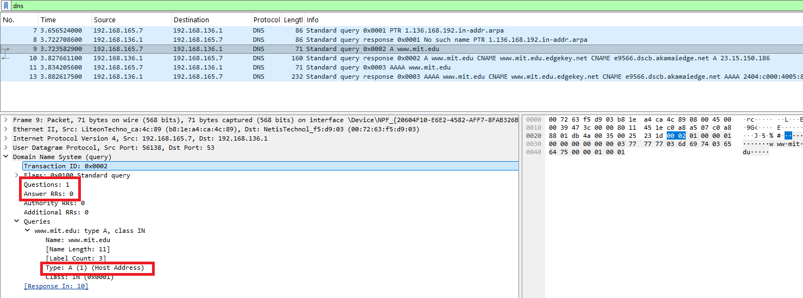
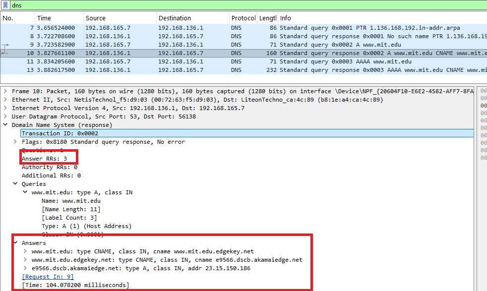

#  Laporan Praktikum Modul 4 Sooal 3
Nur Ro'yul Amin 103072400159 IF 04-04

---
### Pertanyaan dan Jawabannya:

__1. Apa port tujuan pada pesan permintaan DNS? Apa port sumber pada pesan balasan DNS?__

__Jawab__: Pertama mulai capture pada wireshark, kemudian buka cmd dan ketikkan
>nslookup www.mit.edu

kemudian stop capture wireshark.
berikut adalah hasil gambarnya:

pada gambar di atas (pesan permintaan) terlihat kalau destination portnya __53__  maka pot sumber pada pesan balasan adalah __53__ karena hanya dibalik.

__2. Ke alamat IP manakah pesan permintaan DNS dikirimkan? Apakah alamat IP tersebut merupakan default alamat IP server DNS lokal Anda?__  

__Jawab__: Bisa dilihat pada gambar dibawah bahwa permintaan DNS dikirim ke alamat IP 192.168.136.1 dan saat saya cek cmd dan ketik `ipconfig /all` ternyata DNS servernya sama, ya merupakan default alamat IP server DNS lokal saya.

__3. Periksa pesan permintaan DNS. Apa ”jenis” atau ”type” dari pesan tersebut? Apakah pesan tersebut mengandung ”jawaban” atau ”answers”?__ 

__Jawab__: Pada pesan permintaan Jenis dari pesannya adalah A (1) dan pesan tersebut tidak mengandung jawaban/answer karena itu pesan request sesuai dengan gambar dibawah ini.

__4. Periksa pesan balasan DNS. Berapa banyak ”jawaban” atau “answers” yang terdapat di dalamnya. Apa saja isi yang terkandung dalam setiap jawaban tersebut?__

__Jawab__: Pada gambar dibawah ini terlihat bahwa answernya ada 3 dan berikut kotak merah kedua adalah 3 jawabannya.
