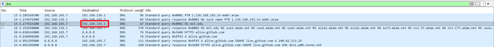
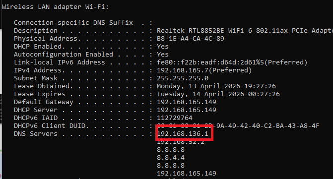
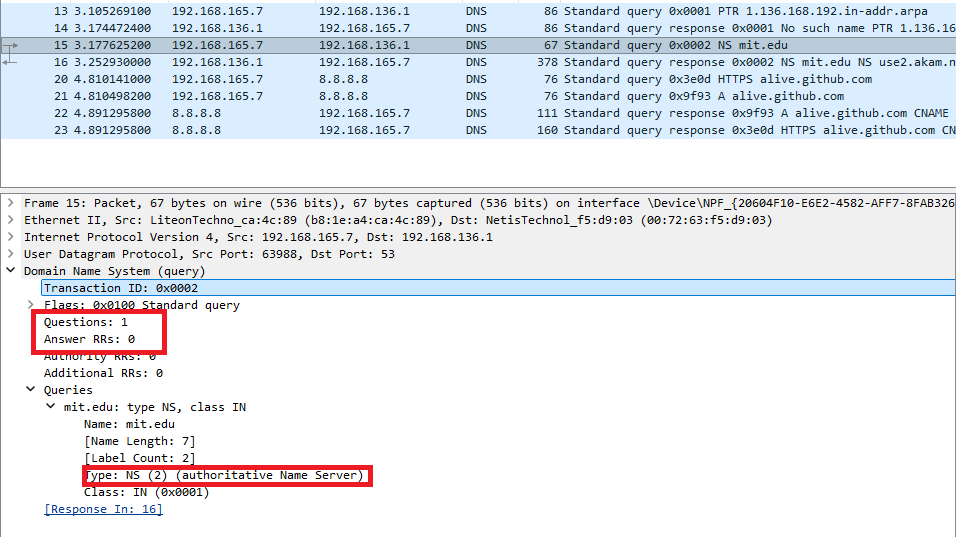
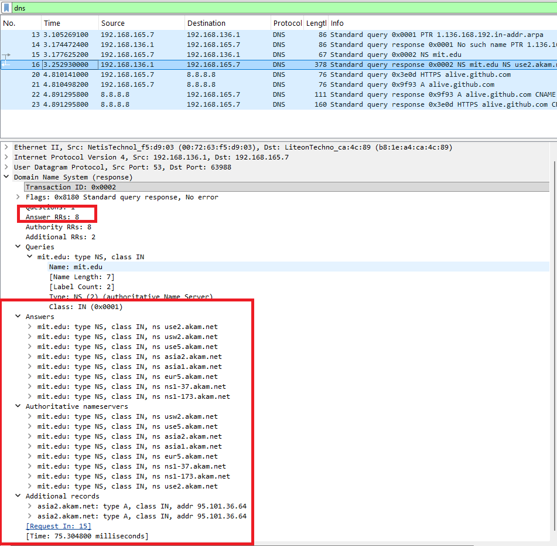

#  Laporan Praktikum Modul 4 Soal 4
Nur Ro'yul Amin 103072400159 IF 04-04

---
### Pertanyaan dan Jawabannya:
__1. Ke alamat IP manakah pesan permintaan DNS dikirimkan? Apakah alamat IP tersebut merupakan default alamat IP server DNS lokal Anda?__

__Jawab__: untuk kerjakan soal ini capture ulang dan masuk cmd lalu ketik `nslookup -type=NS mit.edu` kemudian stop dengan filter dns.
Dari gambar dibawah terlihat bahwa walau beda query namun server DNS lokal dan pesan permintaan sama

__2. Periksa pesan permintaan DNS. Apa ”jenis” atau ”type” dari pesan tersebut? Apakah pesan tersebut mengandung ”jawaban” atau ”answers”?__ 

__Jawab__:  Pada gambar dibawah ini terlihat bahwasannya pesan permintaan hanya berisi question sedangkan answernya 0 dan juga type dari pesan ini adalah NS (2).

__3. Periksa pesan balasan DNS. Apa nama server MIT yang diberikan oleh pesan balasan? Apakah pesan balasan ini juga memberikan alamat IP untuk server MIT tersebut?__ 

__Jawab__: Terlihat pada gambar dibawah bahwasannya pada pesan balasan ada banyak nama server yang diberikan, untuk apakah memberkan alamat IP untuk server MIT jawabannya tidak karena hanya ada alamat NS bukan alamat dari domain mit.edu itu sendiri

