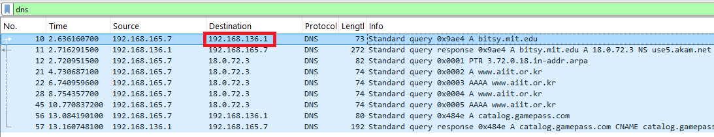
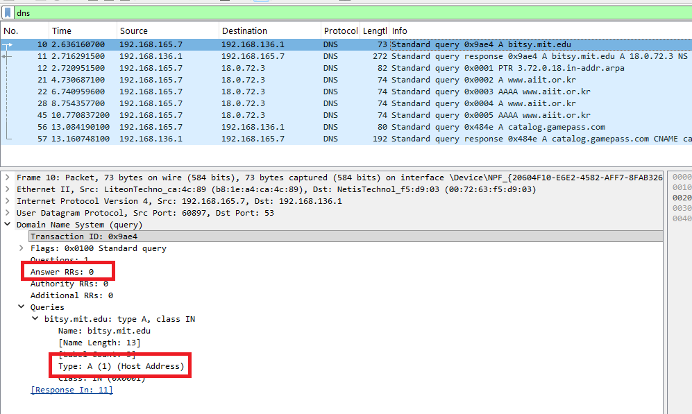
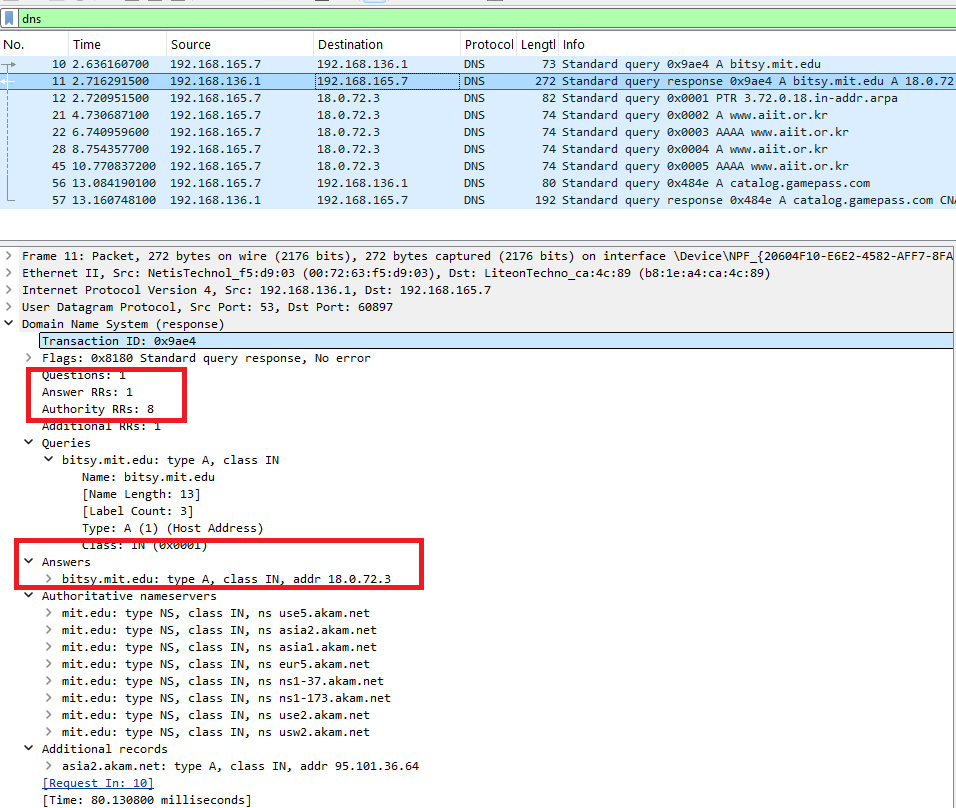

#  Laporan Praktikum Modul 4 Soal 5
Nur Ro'yul Amin 103072400159 IF 04-04

---
### Pertanyaan dan Jawabannya: 

__1. Ke alamat IP manakah pesan permintaan DNS dikirimkan? Apakah alamat IP tersebut merupakan default alamat IP server DNS lokal Anda?__

__Jawab__: Untuk mengerjakan ini perlu untuk melakukan capture ulang wireshark lalu buka cmd dan ketikkan `nslookup www.aiit.or.kr bitsy.mit.edu` kemudian stop wireshark dengan filter dns.
Pada gambar terlihat bahwa destinasinya (192.168.136.1) sama dengan server DNS lokal (192.168.136.1) saya jadi jawabannya ya

 
__2. Periksa pesan permintaan DNS. Apa ”jenis” atau ”type” dari pesan tersebut? Apakah pesan tersebut mengandung ”jawaban” atau ”answers”?__

__Jawab__: Pada gambar dibawah ini typenya adalah A (1)  dan pesan tersebut tidak mengandung jawaban karena itu adalah request, Untuk aiit typenya sama A namun ada juga yang AAAA.

__3. Periksa pesan balasan DNS. Berapa banyak ”jawaban” atau “answers” yang terdapat di dalamnya. Apa saja isi yang terkandung dalam setiap jawaban tersebut?__

__Jawab__: Pada pesan balasan jawabannya ada satu seperti pada gambar dibwaah kotak merah, untuk aiit tidak mempunya tanda pesan request ataupun answer/balasan jadi tidak bisa ditemukan.
