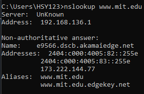
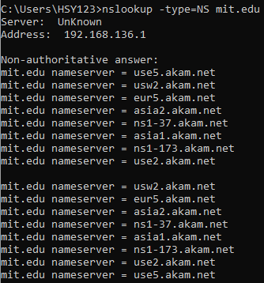
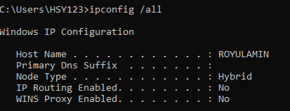

#  Laporan Praktikum Modul 4
Nur Ro'yul Amin 103072400159 IF 04-04

---
#### 1.1 Tujuan Praktikum
1. Memahami nsloopup dan ipconfig
2. Mengerjakan soal

---
### 1. nslookup
Nslookup adalah tools berbasis command line yang digunakan untuk mendapatkan informasi DNS, seperti alamat IP dari suatu domain atau sebaliknya. Tools ini bekerja dengan cara mengirimkan query ke server DNS, lalu menampilkan hasil respon yang diterima. Secara default, nslookup akan menggunakan DNS server lokal yang sudah dikonfigurasi pada perangkat. Selanjutnya praktikum untuk menjalan beberapa jenis nslookup:

>nslookup www.mit.edu 

Perintah ini bertujuan untuk mengetahui alamat IP dari domain www.mit.edu
. Dari hasil yang diperoleh, terdapat dua informasi utama, yaitu server DNS yang memberikan respon serta alamat IP dari domain tersebut. Meskipun query dikirim ke DNS lokal, kemungkinan server tersebut melakukan komunikasi dengan DNS lain untuk mendapatkan jawaban yang sesuai.

>nslookup –type=NS mit.edu

Perintah ini digunakan untuk mengetahui DNS server otoritatif dari domain mit.edu. Hasil yang ditampilkan menunjukkan beberapa nama server yang bertanggung jawab terhadap domain tersebut. Namun, hasil yang diperoleh bersifat non-authoritative, yang berarti informasi tersebut berasal dari cache DNS, bukan langsung dari server utama. 

### 2. ipconfig
Ipconfig (Windows) dan ifconfig (Linux/Unix) merupakan utilitas jaringan yang sangat esensial untuk proses debugging. Meskipun fokus utama pembahasan ini adalah ipconfig, fungsionalitas keduanya sangat serupa. Perintah ini memungkinkan pengguna untuk meninjau konfigurasi TCP/IP secara mendalam, seperti alamat IP, server DNS, serta detail adaptor jaringan. Informasi lengkap mengenai host dapat diperoleh cukup dengan menjalankan perintah:
>ipconfig /all

(Output sebenarnya masih panjang namun dicrop hanya sampai sini karena terlalu panjang)
Ipconfig juga sangat berguna untuk mengelola informasi DNS yang tersimpan dalam host Anda. 

kita telah mempelajari bahwa sebuah host dapat menyimpan catatan DNS yang baru saja diperolehnya, untuk melihat record yang telah disimpan masukkan perintah berikut:  
>ipconfig /displaydns 
Hasil yang didapatkan akan menampilkan record dan sisa Time To Live (TTL) dalam satuan detik. 

Sedangkan untuk menghapus catatan kita bisa ketikkan:
###### Note: tidak disarankan sama asprak kalau tidak salah karena akan hapus historynya
>ipconfig /flushdns

