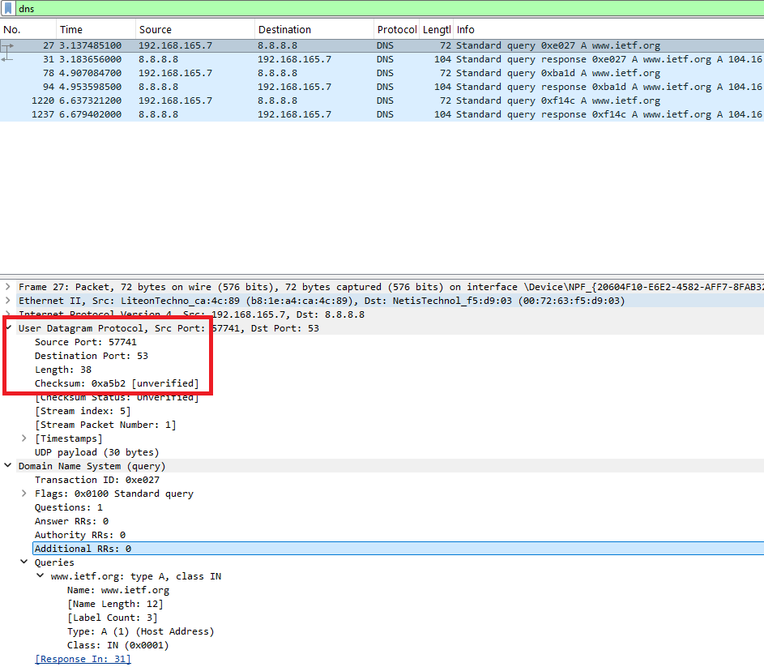
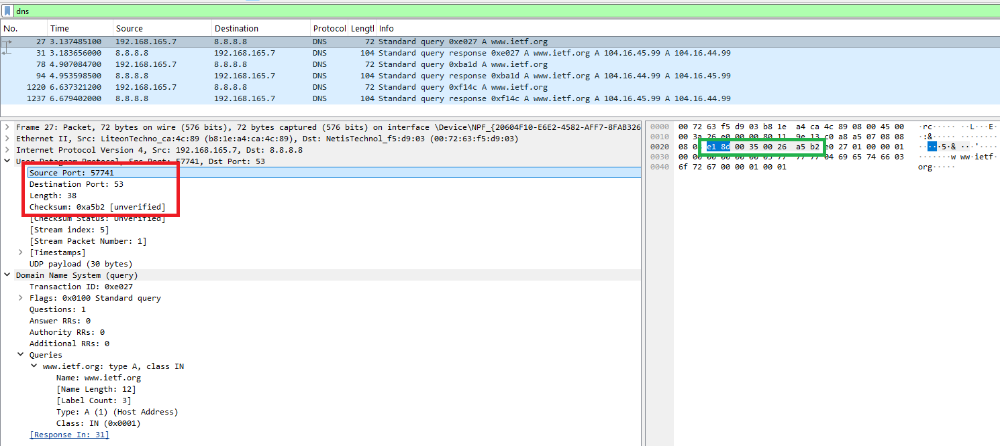
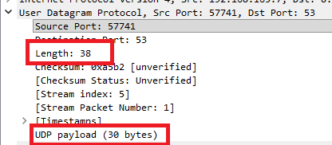
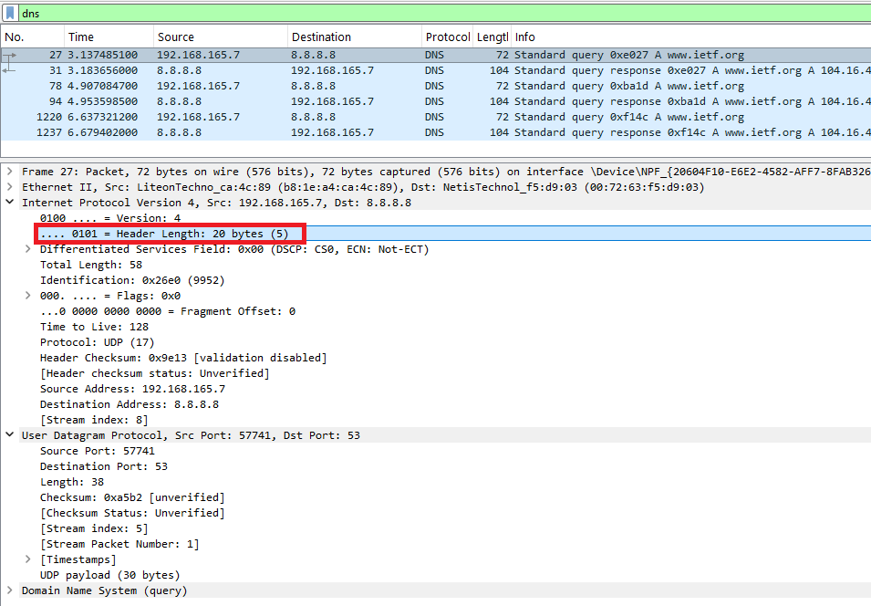
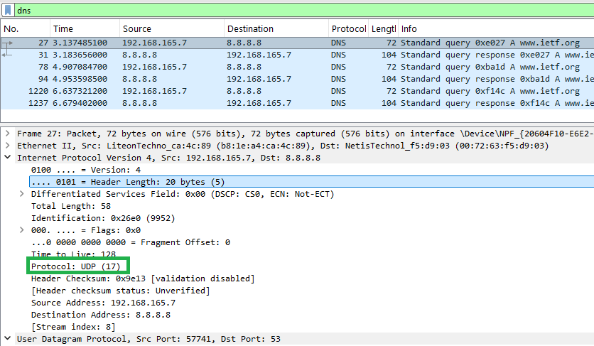
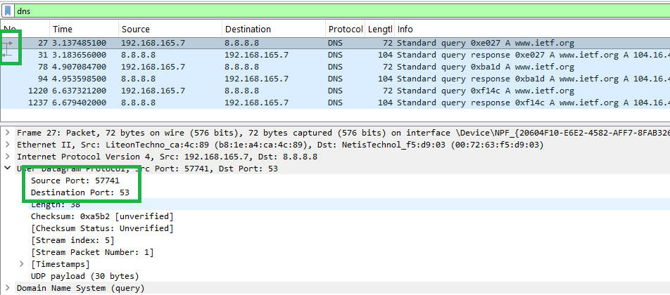
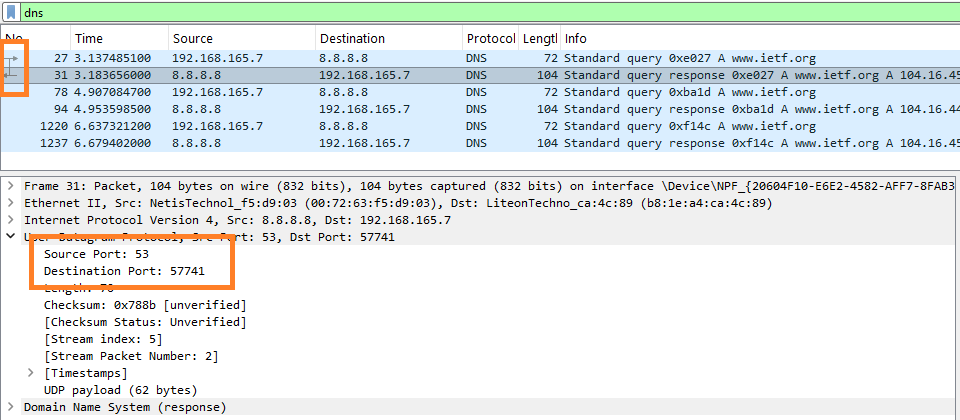

#  Laporan Praktikum Modul 5
Nur Ro'yul Amin 103072400159 IF 04-04

---
### Pertanyaan dan Jawabannya:
__1. Pilih satu paket UDP yang terdapat pada trace Anda. Dari paket tersebut, berapa banyak “field” yang terdapat pada header UDP? Sebutkan nama-nama field yang Anda temukan!__

__Jawab__: Terdapat 4 field yang ada pada UDP yaitu
* Source port
* Destination port
* lenght
* checksum

__2. Perhatikan informasi “content field” pada paket yang Anda pilih di pertanyaan 1. Berapa panjang (dalam satuan byte) masing-masing “field” yang terdapat pada header UDP?__

__Jawab__: Setelah saya lihat setiap content field pada UDP (4 content) pada kotak merah saya melihat bahwa setiap field itu punya 2 byte dan jika ditotal 4 field maka jadinya 8 byte seperti kotak hijau di gambar kanan.
jadinya
Source Port: 2 byte
Destination Port: 2 byte
Length: 2 byte
Checksum: 2 byte
Total: 8 Byte

__3. Nilai yang tertera pada ”Length” menyatakan nilai apa? Verfikasi jawaban Anda melalui paket UDP pada trace.__ 

__Jawab__: Nilai yang terdapat pada field “Length” menunjukkan panjang total dari segmen UDP, yang terdiri dari header UDP (8 byte pada nomor sebelumnya) dan data (payload) DNS. Jadi nilai length sebesar 38 byte terdiri dari 8 byte header UDP dan 30 byte payload DNS. Ini dapat dibuktikan dari paket UDP pada trace, di mana panjang payload DNS (30) + header UDP (8) = 38 sesuai dengan nilai length (38) yang ada.

__4. Berapa jumlah maksimum byte yang dapat disertakan dalam payload UDP? (Petunjuk: jawaban untuk pertanyaan ini dapat ditentukan dari jawaban Anda untuk pertanyaan 2)__

__Jawab__:
field length yang ukurannya 2 byte itu sama dengan 16 bit, kemudian kita cari nilai maksimum dari 16 bit dengan cara 2 dipangkat 16 dikurang 1 ($2^{16}$ - 1 = 65.535), kemudian 65.535 - header UDP (8) - header IP (20, dari gambar di bawah kotak merah) sehingga hasilnya adalah __65.507 byte__

__5. Berapa nomor port terbesar yang dapat menjadi port sumber? (Petunjuk: lihat petunjuk pada pertanyaan 4)__

__Jawab__: Nomor port terbesar yang dapat digunakan sebagai port sumber/source port adalah __65.535__. Karena field port pada UDP memiliki ukuran 16 bit, sehingga nilai maksimum yang dapat direpresentasikan adalah 2^16 − 1 = 65.535.

__6. Berapa nomor protokol untuk UDP? Berikan jawaban Anda dalam notasi heksadesimal dan desimal. Untuk menjawab pertanyaan ini, Anda harus melihat ke bagian ”Protocol” pada datagram IP yang mengandung segmen UDP.__

__Jawab__: Pada gambar dibawah (kotak hijau) terlihat bahwa protokol UDP nya adalah (17) dalam desimal = 17, dalam heksadesimal adalah `0x11`.

__7. Periksa pasangan paket UDP di mana host Anda mengirimkan paket UDP pertama dan paket UDP kedua merupakan balasan dari paket UDP yang pertama. (Petunjuk: agar paket kedua merupakan balasan dari paket pertama, pengirim paket pertama harus menjadi tujuan dari paket kedua). Jelaskan hubungan antara nomor port pada kedua paket tersebut!__

__Jawab__: Pada 2 gambar dibawah terdapat pasangan paket UDP, dimana gambar dengan kotak hijau adalah pengirim pesan (request) dan gambar dengan kotak oranye adalah pembalas pesan (answer).

pada ujung atas kiri pada 2 gambar ada kotak yang menyoroti tanda panah, ke kanan artinya itu log mengirim(request) sedangkan tanda panah ke kiri artinya log membalas (answer).

penjelasan lebih jelasnya: 
* log pertama itu source port = 57741 dan destination = 53
* log kedua itu soruce port = 53 dan destination = 57741
nah darisini terlihat bahwa kedua log UDP ini saling berhubungan.

