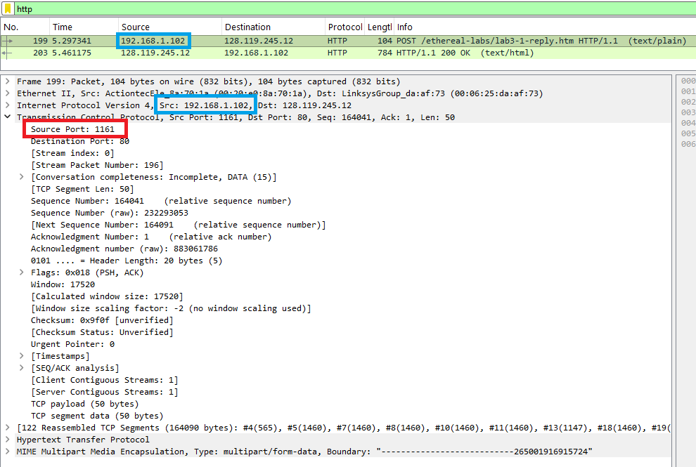
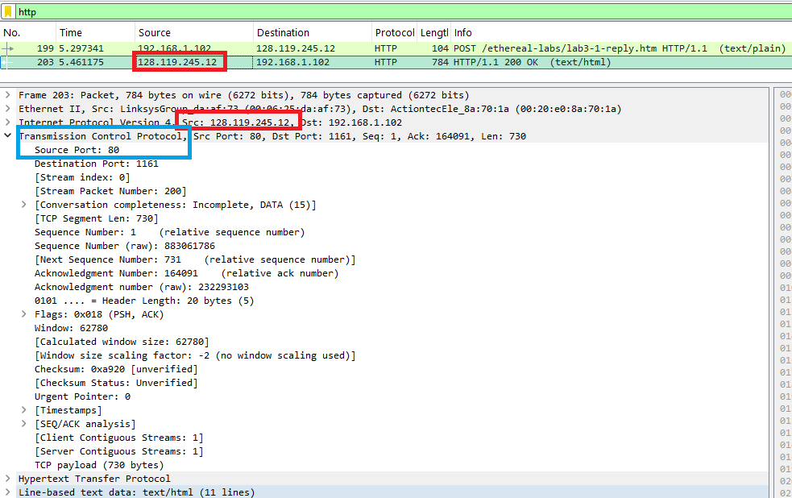

#  Laporan Praktikum Modul 6 TCP
Nur Ro'yul Amin 103072400159 

---

## Tujuan Praktikum
1. Memahami cara kerja protokol TCP menggunakan Wireshark.
2. Menganalisis proses komunikasi TCP seperti sequence number, acknowledgement, RTT, throughput, dan congestion control.
---

Modul 6 membahas mengenai protokol TCP (Transmission Control Protocol) menggunakan aplikasi Wireshark untuk menangkap dan menganalisis paket jaringan.
Untuk bisa melakukan praktiknya kita perlu menyiapkan hal dibawah:
1. Buka http://gaia.cs.umass.edu/wireshark-labs/alice.txt lalu download salinan ASCII dari naskah Alice in Wonderland
2. Buka http://gaia.cs.umass.edu/wireshark-labs/TCP-wireshark-file1.html
3. Buka wiresharknya dan mulai capture
4. Upload File alice.txt di bagian choose file(web diatas)
5. Berhenti melakukan capture

atau kalian bisa juga untuk menggunakan tangkapan paket yang sudah disediakan oleh modul (ada pada folder ini), filenya bernama **tcp-ethereal-trace-1** yang bisa kalian download

Disini saya akan menggunakan hasil tangkapan yang sudah disediakan oleh modul untuk menjawab soal yang ada pada modul.

---

## Pertanyaan Pada Modul Ini Sekaligus Jawabannya

**1. Berapa alamat IP dan nomor port TCP yang digunakan oleh komputer klien (sumber) untuk mentransfer file ke gaia.cs.umass.edu? Cara paling mudah menjawab pertanyaan ini adalah dengan memilih sebuah pesan HTTP dan meneliti detail paket TCP yang digunakan untuk membawa pesan HTTP tersebut.**

Alamat IP klien adalah 192.168.1.102 (Kotak Biru)
Nomor Port TCP klien adalah 1161 (Kotak Merah)

**2. Apa alamat IP dari gaia.cs.umass.edu? Pada nomor port berapa ia mengirim dan menerima segmen TCP untuk koneksi ini?**

Alamat IP dari server gaia.cs.umass.edu adalah 128.119.245.12 (Kotak Merah)
Nomor Port TCPnya adalah 80 (Kotak Biru)

**3. Berapa nomor urut segmen TCP SYN yang digunakan untuk memulai sambungan TCP antara komputer klien dan gaia.cs.umass.edu? Apa yang dimiliki segmen tersebut sehingga teridentifikasi sebagai segmen SYN?**

**4. Berapa nomor urut segmen SYNACK yang dikirim oleh gaia.cs.umass.edu ke komputer klien sebagai balasan dari SYN? Berapa nilai dari field Acknowledgement pada segmen SYNACK? Bagaimana gaia.cs.umass.edu menentukan nilai tersebut? Apa yang dimiliki oleh segmen sehingga teridentifikasi sebagai segmen SYNACK?**

**5. Berapa nomor urut segmen TCP yang berisi perintah HTTP POST? Perhatikan bahwa untuk menemukan perintah POST, Anda harus menelusuri content field milik paket di bagian bawah jendela Wireshark, kemudian cari segmen yang berisi "POST" di bagian field DATAnya.**

**6. Anggap segmen TCP yang berisi HTTP POST sebagai segmen pertama dalam koneksi TCP. Berapa nomor urut dari enam segmen pertama dalam TCP (termasuk segmen yang berisi HTTP POST)? Pada jam berapa setiap segmen dikirim? Kapan ACK untuk setiap segmen diterima? Dengan adanya perbedaan antara kapan setiap segmen TCP dikirim dan kapan acknowledgement-nya diterima, berapakah nilai RTT untuk keenam segmen tersebut? Berapa nilai EstimatedRTT setelah penerimaan setiap ACK? (Catatan: Wireshark memiliki fitur yang memungkinkan Anda untuk memplot RTT untuk setiap segmen TCP yang dikirim. Pilih segmen TCP yang dikirim dari klien ke server gaia.cs.umass.edu pada jendela "daftar 35 JARINGAN KOMPUTER paket yang ditangkap". Kemudian pilih: Statistics->TCP Stream Graph- >Round Trip Time Graph).**

**7. Berapa panjang setiap enam segmen TCP pertama?**

**8. Berapa jumlah minimum ruang buffer tersedia yang disarankan kepada penerima dan diterima untuk seluruh trace? Apakah kurangnya ruang buffer penerima pernah menghambat pengiriman?**

**9. Apakah ada segmen yang ditransmisikan ulang dalam file trace? Apa yang anda periksa (di dalam file trace) untuk menjawab pertanyaan ini?**

**10. Berapa banyak data yang biasanya diakui oleh penerima dalam ACK? Dapatkah anda mengidentifikasi kasus-kasus di mana penerima melakukan ACK untuk setiap segmen yang diterima?**

**11. Berapa throughput (byte yang ditransfer per satuan waktu) untuk sambungan TCP? Jelaskan bagaimana Anda menghitung nilai ini.**

