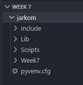
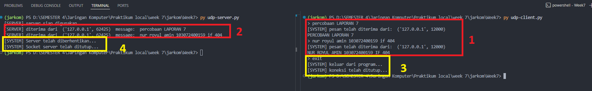
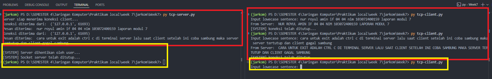

#  Laporan Praktikum Modul 7 Socket Programming
Nur Ro'yul Amin 103072400159 

---
Pertama-tama kita masuk ke vscode dan direktori yang diinginkan untuk melakukan praktkum ini kemudian buka terminal dan ketikkan hal dibawah ini:
```python
python 3.11 -m venv jarkom
```
disini kita akan menggunakan python versi 3.11 untuk buat venv nya dan nanti akan terbuat sebuah folder bernama jarkom yang akan berisi beberapa folder seperti gambar dibawah.

kemudian kalian bisa buat folder baru bernama week 7 dan kita mulai praktikum Socket Programming ini.

---
### CODE UDP 
**1. Kita sekarang akan mulai dengan kode dari UDP Server**
Berikut adalah kode untuk UDP Server, penjelasan sudah ada pada codenya jadi saya tidak perlu tulis di MD nya lagi :D
```python
from socket import * #import semua method yang ada di socket

#membuat socket UDP
serverPort = 12000                         #memilih port yang akan digunakan untuk server
serverSocket = socket(AF_INET, SOCK_DGRAM) #AF_INET adalah IP addr v4 dan SOCK_DGRAM adalah UDP

#menghubungkan / bind
serverSocket.bind( # digunakan untuk menghubungkan socket dengan alamat tertentu
    # tuple (alamat IP, port)
    ('', serverPort) #pakai string kosong agar tidak perlu seting banyak-banyak
)

print("[SERVER] server siap digunakan...") #print kalimat disamping untuk awalan ketika file dijalankan

#while dijalankan selama running bernilai true
running = True #variabel yang menyebabkan while jalan
while running: #perulangan untuk menerima pesan dari client
    message, clientAddress = serverSocket.recvfrom(2048) #
    #recevfrom digunakan untuk menerima pesan dari client, 2048 adalah ukuran buffer untuk menerima pesan, clientAddress adalah alamat client yang mengirim pesan
    
    decodeMessage = message.decode() 
    #decode pesan yang diterima dari client, karena pesan yang diterima masih dalam bentuk byte, maka perlu di decode agar bisa dibaca oleh manusia

    #pakai .lower agar semua input jadi lowercase, sehingga jika client mengetik "EXIT" atau "Exit" tetap bisa terdeteksi sebagai perintah untuk keluar
    if decodeMessage.lower() == "exit": #sistem untuk mendeteksi jika client keluar dari program (dengan ketik exit) dan running akan menjadi false 
        print("[SYSTEM] Server telah diberhentikan...") #print kalimat disamping
        running = False #ubah running jadi false
        continue        #lanjut ke iterasi berikutnya, sehingga tidak menjalankan kode dibawahnya yang mengirim pesan ke client
    
    #meng Uppercase pesan yang diterima dari client
    modifiedMessage = decodeMessage.upper()
    #jadi decodenya diubah menjadi uppercase, sehingga jika client mengirim "hello" maka server akan mengubahnya menjadi "HELLO" sebelum mengirim kembali ke client
    print("[SERVER] diterima dari ", clientAddress, " message: ", decodeMessage)
    #print kalimat disamping untuk menampilkan pesan yang diterima dari client, clientAddress adalah alamat client yang mengirim pesan
    #decodeMessage adalah pesan yang diterima dari client setelah di decode

    #mengirim ke client dengan sendto
    serverSocket.sendto( 
        modifiedMessage.encode(), #mengirim pesan yang sudah UPpercase ke client, perlu di encode dulu oleh sistemnya client
        clientAddress             #kirim ke client yang kirim pesan
    )   

serverSocket.close() #menutup socket dari server (perhatikan indentasi)  
print("[SYSTEM] Socket server telah ditutup...") #print kalimat disamping
```

**2. Kita sekarang akan mulai dengan kode dari UDP Client**
Berikut adalah kode untuk UDP Client, penjelasan sudah ada pada codenya jadi saya tidak perlu tulis di MD nya lagi :D
```python
from socket import * #import semua method yang ada di socket

serverName = "localhost" #berinama servername dengan localhost
serverPort = 12000       #port harus sama dengan port server

#client socket diassign AF_INET adalah IP addr v4, SOCK_DGRAM adalah UDP
clientSocket = socket(AF_INET, SOCK_DGRAM)

running = True #running bernilai true agar while jalan
while running: #while untuk mengirim pesan ke server dan menerima pesan dari server
    message = input("> ") #input dari user untuk dikirim ke server
    if message.lower() == "exit": #cek jika user ingin keluar dari prgram dengan ketik exit
        #mengirim pesan exit ke server agar server tau client mau keluar
        clientSocket.sendto( #pakai sendto
            message.encode(),#encode pesan  pesan exit yang akan dikirim ke server  
            (serverName, serverPort) #tuple( alamat ip, port) ke server
        )

        print("[SYSTEM] keluar dari program...") #print kaliamt disamping
        running = False                          #running jadi false agar while berhenti
        continue                            

    clientSocket.sendto( #masih dalam while diluar if nya exit, buat sendto server kalimat yang mau dikirim ke server
        #misalnya jarkom nanti di encode jadinya 10101010101000110
        message.encode(), #encode seperti contoh diatas ini
        #tuple (alamat IP, port) ke server
        (serverName, serverPort)
    )

    #menerima pesan dari server dengan recvfrom, 2048 adalah ukuran buffer untuk menerima pesan, modifiedMessage adalah pesan yang diterima dari server, serverAddress adalah alamat server yang mengirim pesan
    modifiedMessage, serverAddress = clientSocket.recvfrom(2048)

    print("[SYSTEM] pesan telah diterima dari: ",serverAddress) #print kalimat disamping, untuk tau server yang balas pesan
    print(modifiedMessage.decode()) #encode pesan yang didapat dari server, karena masih bentuk byte

#menutup socket dari client 
clientSocket.close() #
print("[SYSTEM] koneksi telah ditutup...") #print kalimat disamping beritahu koneksi diputus
```
hal yang penting disini adalah: komunikasi client-server menggunakan protokol UDP (User Datagram Protocol) dengan memanfaatkan library socket pada Python. Server dikonfigurasi menggunakan AF_INET dan SOCK_DGRAM, Proses komunikasi dijalankan secara connectionless, dimana client dapat langsung mengirimkan pesan ke server tanpa perlu membangun koneksi terlebih dahulu. Server menerima pesan menggunakan recvfrom(), kemudian memproses data dengan mengubah isi pesan menjadi huruf kapital, dan mengirimkan kembali hasilnya ke client menggunakan sendto(). Server dan client harus mempunyai port yang sama(disini 12000) dan konsep saling kirim pesannya itu dengan encode dan decode dari apa yang dikirim/diinputkan, kita juga perlu buat pengecekan agar bisa keluar dari program dengan ketikkan exit.

**3. Output Code UDP**
Nah untuk menjalankan codenya sediri saat membuka terminal kita bisa ketikkan code bawah ini agar virtual environment (Venv.) kita aktif
```python
jarkom\Scripts\activate
```
Setelah kode ini dijalankan selanjutnya setelah pencet terminal seharusnya akan langsung masuk ke masuk ke Venv. kita.
Bisa dilihat untuk hasil kodenya:

---
### CODE TCP 
**1. Kita sekarang akan mulai dengan kode dari TCP Server**
Berikut adalah kode untuk TCP Seerver, penjelasan sudah ada pada codenya jadi saya tidak perlu tulis di MD nya lagi :D
```python
from socket import * #socket melakukan import semua fungsi dari lib socket

serverPort = 12000   #port yang digunakan untuk server (bebas namun disini pilih 12000)

serverSocket = socket(AF_INET, SOCK_STREAM) #AF_INET = IPv4, sock STREAM adalah TCP kalau DGRAM itu UDO

#masukkan semua ip yang ada pada port 12000, pakai string kosong agar bisa terima semua ip yang kirim ke server ini
serverSocket.bind(('', serverPort)) 

serverSocket.listen(5) #pemrograman ini akan menungguu client connecting, 5 = jumlah client yang bisa menunggu
print('Server siap menerima koneksi client...') #print kalimat server siap 
    
#try except yang digunakan oleh ASPRAK agar server bisa dimatikan dengan client CTRL + C dari client
#namun terkadang agak aneh karena server tidak langsung mati
try:
    while True: #selama server jalan maka akan terus menerima koneksi dari client
        try:
            #menerima koneksi dari client
            connectionSocket, addr = serverSocket.accept() #accept untuk terima konseksi dari client
            print('Koneksi diterima dari: ', addr)         #print kalimat disamping, dengan addr dari client yang terhubung
            #menerima pesan dari client

            sentence = connectionSocket.recv(2048).decode() #terima 2048 byte data dari user lalu decode ke string
            print('Pesan diterima: ', sentence)             #print kalimat disamping dengan kalimat yang udah di decode

            modifiedSentence = sentence.upper() #mengubah pesan menjadi uppercase
            
            connectionSocket.send(modifiedSentence.encode()) #mengirim pesan yang sudah diubah ke client, di encode dulu ke byte lalu dikirim
            
            connectionSocket.close() #menutup koneksi dengan client, namun disini tidak bisa jadi pakailah try except finally dll,
                                     #setelah melakukan percobaan ternyata yang harus melakukan ctrl c adalah dari terminal server lalu saat client coba connect maka tiidak bisa karena server udah tutup
        except timeout:
            continue
except KeyboardInterrupt: #jika user menekan CTRL + C maka server akan berhenti, namun terkadang agak aneh karena server tidak langsung mati
    print("\n[SYSTEM] Server dihentikan oleh user...") #print kaliamt disamping
finally:                                               #finally untuk pastikan server ditutup ada error ataupun tidak
    serverSocket.close()                         #tutup socket server
print("[SYSTEM] Socket server telah ditutup...") #print kalimat disamping

```
hal yang penting disini adalah:

**2. Kita sekarang akan mulai dengan kode dari TCP Client**
Berikut adalah kode untuk TCP Client, penjelasan sudah ada pada codenya jadi saya tidak perlu tulis di MD nya lagi :D
```python
from socket import * #import semua fungsi dari lib socket

serverName = "localhost" #memberi nama serber(bebas namun disini pilih localhost)
serverPort = 12000       #port agar client terhubung ke server yang sudah kita buat

#buat socket TCP untuk client, STREAM artinya TCP
clientSocket = socket(AF_INET, SOCK_STREAM)

#connectt ke server dengan nama dan port yang udah dibuat tadi, dengan tuple (serverName, serverPort)
clientSocket.connect((serverName, serverPort))

#input kalimat dari user, lalu encode ke byte agar bisa dikirim ke server
sentence = input('Input lowecase sentence: ')
clientSocket.send(sentence.encode()) #lakukan encode ke byte lalu kirim ke server

#menerima pesan dari server, lalu decode ke string agar bisa dibaca
modifiedSentence = clientSocket.recv(2048) #ukuran 2048 itu jumlah byte yang bisa diterima dari server
print('From Server: ', modifiedSentence.decode()) #decode ke string lalu print kalimat disamping dengan kalimat yang sudah di decode

#tutup koneksi dengan server, karena TCP itu koneksi jadi harus ditutup kalau selesai
clientSocket.close()
print("[SYSTEM] koneksi telah ditutup...") #print kalimat disamping 
```
hal yang penting disini adalah: komunikasi client-server menggunakan protokol TCP (Transmission Control Protocol) dengan memanfaatkan library socket pada Python. Server dikonfigurasi menggunakan AF_INET dan SOCK_STREAM, serta melakukan binding pada port tertentu dan mendengarkan koneksi dari client menggunakan fungsi listen(). TCP merupakan protokol yang bersifat connection-oriented, dimana client harus membangun koneksi terlebih dahulu dengan server sebelum melakukan pertukaran data. Server berhasil menerima, memproses, dan mengirim kembali data menggunakan fungsi accept(), recv(), dan send(). TCP memberikan keandalan dalam komunikasi data, namun memiliki overhead yang lebih besar dibandingkan UDP.

**3. Output Code TCP**
Nah untuk menjalankan codenya sediri saat membuka terminal kita bisa ketikkan code bawah ini agar virtual environment (Venv.) kita aktif
```python
jarkom\Scripts\activate
```
Setelah kode ini dijalankan selanjutnya setelah pencet terminal seharusnya akan langsung masuk ke masuk ke Venv. kita.
Bisa dilihat untuk hasil koden nya:

---

### Kesimpulan Akhir
Berdasarkan hasil praktikum, komunikasi client-server menggunakan protokol UDP dan TCP itu ada perbedaannya dalam mekanisme dan karakteristik pengiriman data.

Pada implementasi UDP, komunikasi berlangsung secara connectionless, dimana client dapat langsung mengirimkan pesan ke server tanpa membangun koneksi terlebih dahulu. Output yang dihasilkan menunjukkan bahwa server langsung menerima pesan menggunakan recvfrom(), memprosesnya menjadi huruf kapital, dan mengirimkan kembali ke client menggunakan sendto(). Proses ini berlangsung cepat dan sederhana, namun tidak terdapat jaminan bahwa data akan sampai ke tujuan.

Sebaliknya, pada implementasi TCP, komunikasi bersifat connection-oriented, dimana client harus melakukan koneksi ke server terlebih dahulu menggunakan connect(), dan server menerima koneksi melalui accept(). Output menunjukkan adanya proses pembentukan koneksi sebelum pertukaran data terjadi. Setelah koneksi terbentuk, data dikirim dan diterima menggunakan send() dan recv(), kemudian koneksi ditutup dengan close(). Hal ini bukti keandalan dalam pengiriman data karena TCP menjamin data sampai, berurutan, dan bebas duplikasi.

Dari hasil tersebut dapat disimpulkan bahwa UDP lebih unggul dalam hal kecepatan dan efisiensi karena tidak memiliki overhead koneksi, sedangkan TCP lebih unggul dalam keandalan dan kontrol komunikasi. Pemilihan protokol bergantung pada kebutuhan aplikasi, dimana UDP cocok untuk komunikasi real-time seperti streaming dan game, sedangkan TCP lebih sesuai untuk aplikasi yang membutuhkan keakuratan data seperti transfer file dan layanan web.