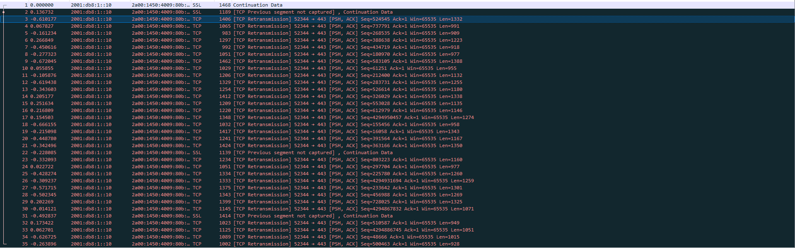
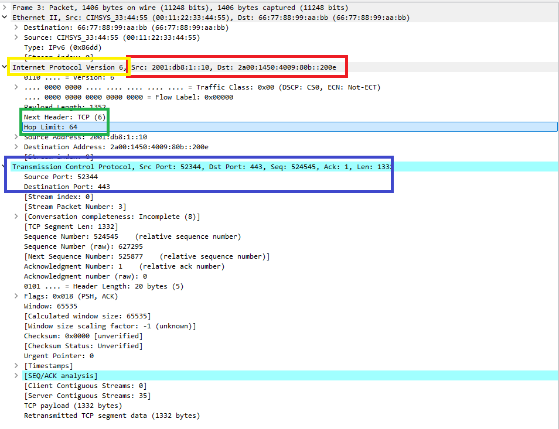

#  Laporan Praktikum Modul 10 IP (Internet Protocol)
Nur Ro'yul Amin 103072400159 

---

## Tujuan Praktikum
1. Memahami konsep dasar IPv4 dan IPv6.
2. Memahami fungsi ICMP pada jaringan komputer.
3. Memahami proses fragmentasi paket IP.
4. Menganalisis paket IP menggunakan Wireshark.
---

### 1. Pengertian IP Secara Singkat
Internet Protocol (IP) merupakan protokol pada layer network yang bertugas mengatur pengalamatan dan pengiriman paket data dari sumber menuju tujuan melalui jaringan komputer. IP bekerja dengan sistem pengalamatan unik berupa alamat IP sehingga setiap perangkat dapat dikenali di dalam jaringan.

---

### 2. Tracert atau Traceroute
Tracert (Traceroute) adalah utilitas jaringan yang digunakan untuk mengetahui jalur yang dilewati paket data dari komputer pengirim menuju host tujuan. Tracert bekerja dengan memanfaatkan nilai TTL (Time To Live) pada paket IP.

Ketika nilai TTL habis di suatu router, router tersebut akan mengirimkan pesan ICMP Time Exceeded kepada pengirim. Dengan cara tersebut, tracert dapat menampilkan daftar router yang dilewati paket hingga mencapai tujuan akhir.

Singktatnya Tracert membantu proses analisis jaringan karena dapat menunjukkan jumlah hop dan waktu tempuh paket menuju tujuan.Pada sistem operasi Windows digunakan perintah tracert, berikut contoh penerapannya:

Pada gambar diatas itu adalah kode dalam CMD yang dapat ditulis `tracert gaia.umass.edu` maka akan melakukan traing sebanyak 30 kali (30 hops) namun ada kalanyya hanya tracing hanya mencapai 28 karena ada kemungkinan router itu tidak memberikan jawaban/response namun pada percobaan saya hops nya lengkap 30.

---

### 3. Time To Live (TTL)
TTL (Time To Live) adalah field pada header IPv4 yang digunakan untuk membatasi umur paket dalam jaringan. TTL berfungsi untuk mencegah paket terus berputar tanpa henti apabila terjadi looping pada proses routing.Setiap kali paket melewati sebuah router, nilai TTL akan dikurangi sebesar satu.

Jika nilai TTL mencapai 0, router akan membuang paket tersebut dan mengirimkan pesan ICMP Time Exceeded kepada pengirim.

TTL juga digunakan pada proses traceroute/tracert. Program traceroute mengirim paket dengan nilai TTL yang meningkat secara bertahap mulai dari 1, 2, 3, dan seterusnya untuk mengetahui jalur router yang dilewati paket menuju tujuan.

---

### 4. Internet Control Message Protocol (ICMP)
ICMP atau Internet Control Message Protocol adalah protokol pada layer network yang digunakan untuk mengirimkan pesan kontrol, informasi kesalahan, dan diagnostik pada jaringan komputer. ICMP bekerja bersama Internet Protocol (IP) untuk membantu perangkat jaringan mengetahui kondisi pengiriman paket data.

ICMP tidak digunakan untuk mengirim data utama pengguna seperti file atau pesan, melainkan digunakan untuk memberikan informasi terkait proses komunikasi jaringan.

Fungsi ICMP biasanya untuk melakukan Ping, Kirim pesan balasan dan kondisi jaringan kalau terjadi eror saat mengirim pesan dan lain-lain.

Berikut adalah prakktik analisis pada wireshark:

= = = = = = = = = = = = =  = = =  = = = = Pemisah = = = = = = = =  = = = =  = = = = = = = = = =

= = = = = = = = = = = = =  = = =  = = = = Pemisah = = = = = = = =  = = = =  = = = = = = = = = =

= = = = = = = = = = = = =  = = =  = = = = Pemisah = = = = = = = =  = = = =  = = = = = = = = = =
Pada hasil praktik pada Wireshark, proses traceroute bekerja dengan mengirim paket ICMP Echo Request menggunakan nilai TTL (Time To Live) yang meningkat secara bertahap mulai dari TTL = 1, TTL = 2, TTL = 3, dan seterusnya. Nilai TTL berfungsi sebagai batas jumlah hop atau router yang dapat dilewati paket di jaringan. Setiap router yang dilewati akan mengurangi nilai TTL sebesar satu. Ketika nilai TTL mencapai nol, router akan membuang paket tersebut dan mengirimkan pesan ICMP Time Exceeded kepada host pengirim. Pada gambar pertama terlihat bahwa TTL nya itu 1 karena tracert pada cmd itu baru kirim request pertama sedangkan pada gambar kedua menunjukkan bahwa TTL sekarang itu 28 artinya sudah sudah mengirim ke 28 kali, maksimal hops sendiri 30 namun ada router yang tidak kirim response jadi hanya tertampil 28 dan pada TTL 28 ini didapatkan lah response yang terlihat pada hambar ketiga

Pada hasil capture terlihat penggunaan protokol ICMP (Internet Control Message Protocol) yang digunakan untuk fungsi diagnostik jaringan seperti ping dan traceroute. Paket dikirim dari source address 192.168.100.133 menuju destination address 128.119.245.12. Selain pesan Time Exceeded, pada beberapa paket juga muncul pesan “Destination Unreachable (Port Unreachable)” yang menunjukkan bahwa paket telah berhasil mencapai host tujuan, namun port tujuan yang digunakan tidak tersedia atau tidak terbuka. Hal ini menandakan bahwa proses traceroute telah mencapai tujuan akhir.

---

### 5. IPv4 dasar
IPv4 atau Internet Protocol version 4 merupakan versi IP yang paling banyak digunakan pada jaringan komputer. IPv4 menggunakan alamat sepanjang 32 bit yang biasanya ditulis dalam format desimal bertitik, misalnya 192.168.1.1.

Pada bagian ini kita menggunakan wireshark untuk melakukan praktikumnya, nah praktiknya ada pada sub-bab di atas (ICMP) karena satu bagian.

---

### 6. Fragmentasi
Fragmentasi adalah paket IP yang dipecah  menjadi beberapa bagian yang lebih kecil ketika ukuran paket melebihi nilai Maximum Transmission Unit (MTU) pada media jaringan. Hal ini dilakukan agar paket tetap dapat dikirim melalui jaringan yang memiliki batas ukuran frame tertentu. Pada IPv4, fragmentasi dapat dilakukan oleh router maupun host pengirim. Setiap fragmen akan memiliki header IP sendiri yang berisi informasi seperti Identification, Flags, dan Fragment Offset untuk membantu proses penyusunan kembali paket di sisi tujuan. Setelah seluruh fragmen diterima, host tujuan akan melakukan penggabungan sehingga data kembali menjadi paket utuh. Pada gambar paada sub-bab ICMP terdapat tulisan fragment offset 0 artinya paket belum dipecah atau bbelum ada proses fragmentasi.

---

### 7. IPv6
IPv6 (Internet Protocol Version 6) adalah pengembangan dari IPv4 yang dibuat untuk mengatasi keterbatasan jumlah alamat IP pada IPv4. IPv6 menggunakan alamat sepanjang 128 bit sehingga mampu menyediakan jumlah alamat yang jauh lebih besar dibandingkan IPv4. Pada IPv6, field TTL digantikan dengan Hop Limit dan router tidak melakukan fragmentasi paket seperti pada IPv4.

Berikut adalah hasil analisis praktikumnya:

= = = = = = = = = = = = =  = = =  = = = = Pemisah = = = = = = = =  = = = =  = = = = = = = = = =

Berdasarkan hasil capture Wireshark terlihat komunikasi menggunakan Internet Protocol Version 6 (IPv6) dengan alamat sumber 2001:db8:1::10 dan alamat tujuan 2a00:1450:4009:80b::200e. Header IPv6 menunjukkan nilai Hop Limit sebesar 64 yang berfungsi membatasi jumlah hop paket di jaringan. Selain itu terdapat field Next Header dengan nilai TCP (6) yang menunjukkan bahwa paket IPv6 membawa segmen TCP. Pada lapisan TCP terlihat source port 52344 dan destination port 443 yang menandakan komunikasi HTTPS. Flag PSH dan ACK menunjukkan bahwa paket digunakan untuk pengiriman data sekaligus acknowledgment terhadap data sebelumnya. Berdasarkan hasil pengamatan tidak ditemukan Fragment Header sehingga paket IPv6 yang diamati tidak mengalami fragmentasi.

TCP melakukan retransmission karena paket sebelumnya tidak menerima acknowledgment (ACK) dari penerima dalam waktu tertentu. Hal ini dapat terjadi akibat packet loss, gangguan jaringan, congestion, atau paket yang terlambat diterima. Oleh karena itu, TCP mengirim ulang segmen data untuk memastikan data tetap sampai dengan lengkap dan andal ke tujuan.