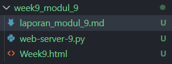
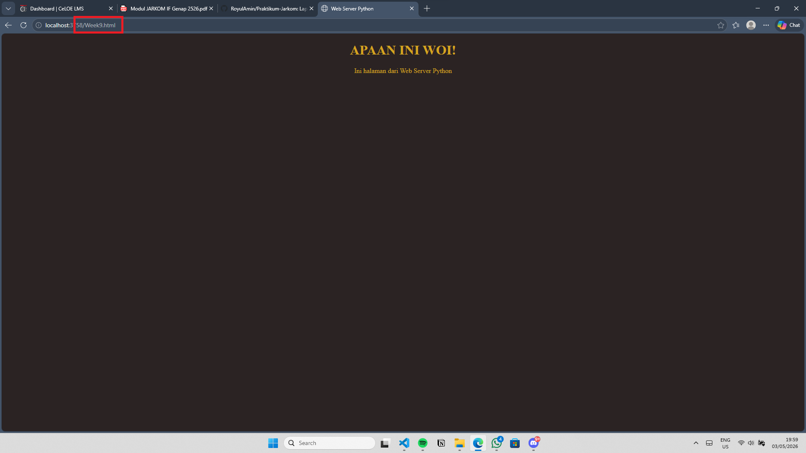
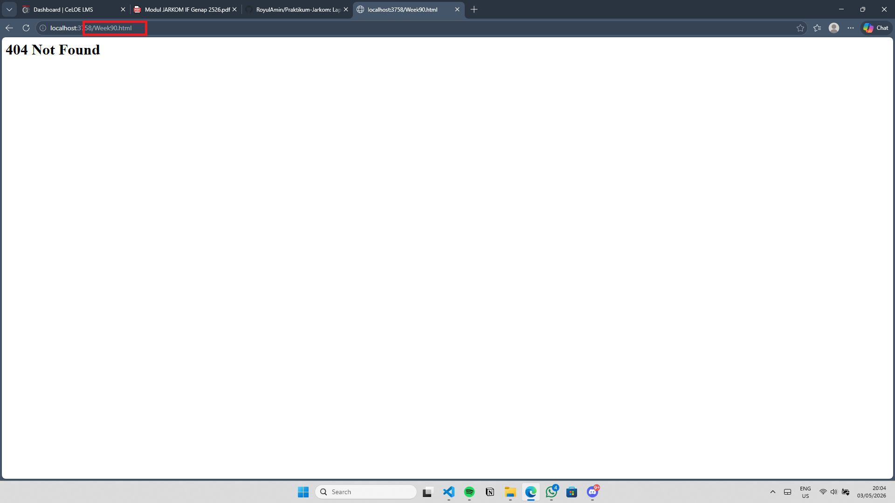

#  Laporan Praktikum Modul 9 Web Server
Nur Ro'yul Amin 103072400159 

---

### Tujuan Praktikum

1. Memahami konsep dasar Web Server
2. Mengetahui cara kerja komunikasi antara client dan server menggunakan HTTP
3. Mengimplementasikan Web Server sederhana menggunakan Python.

---

#### Kode Python Untuk Web Server
Dibawah ini adalah kode untuk web server, penjelasan ada pada sebelah kode berbentuk komen sehingga saya tidak perlu menjelaskan ulang pada MarkDown ini :D

```python
from socket import * #mengimport semua library socket

serverPort = 3758    #memilih port bebas untuk server
serverSocket = socket(AF_INET, SOCK_STREAM) #menggunakan TCP sebagai protokolnya
serverSocket.bind(('', serverPort))  #mengikat socket ke port yang telah dipilih

serverSocket.listen(3)               #server terima konseksi dengan antrian maks 3
print('Server siap menerima koneksi client...') #print kalimat disamping

while True: #perulangan untuk terus menerima koneksi dari client
    connectionSocket, addr = serverSocket.accept() #terima konseksi dari client dengan address client
    print('Siap melayani address... ', addr)       #print kalimat disamping dengan address client

    try:  #try untuk menerima pesan dari client dan memprosesnya
        message= connectionSocket.recv(2048).decode() #terima pesan dgn ukuran 2048 byte dan masukkan ke variable message
        print('pesan diterima: ', message)            #print kalimat pesan diterima dengan isi pesan

        #ini yang disuruh lengkapi dari modul 9
        filename = message.split()[1] #memisahkan pesan dengan spasi dan mengambil bagian kedua sebagai nama file
        f = open(filename[1:])        #hapus karakter "/" pada pesan dan buka file dengan nama tersebut
        
        outputdata = f.read()         #baca file dan simpan pada variable outputdata  
        connectionSocket.send("HTTP/1.1 200 OK\r\n\r\n".encode()) #kirim response header HTTP 200 OK ke client
        
        #ini yang disuruh lengkapi dari modul 9
        for i in range(0, len(outputdata)):   #perulangan untuk kirim data pecahan HTML ke client
            connectionSocket.send(outputdata[i].encode()) #kirim data pecahan HTML ke client dengan encode

        connectionSocket.send("\r\n".encode()) #kirim karakter baru untuk menandai akhir dari response 
        connectionSocket.close()               #tutup koneksi dengan client

    except:
        connectionSocket.send("HTTP/1.1 404 Not Found\r\n".encode()) #digunakan untuk kirim status header 404 error
        connectionSocket.send("Content-Type: text/html\r\n".encode()) #beritahu browser bahwa yang dikirim HTML
        connectionSocket.send("\r\n".encode())                   #tandai bahawa response dari server udah selesai
        connectionSocket.send("<h1>404 Not Found</h1>".encode()) #kirim Body HTML 404 not found
                                                                         # biasanya karena file tidak ditemukan (404)
    connectionSocket.close()#diluar whle, tutup koneksi dengan client
```

#### Kode HTML untuk Web Server
Berikut adalah kodenya
```python
<!DOCTYPE html>
<html>
<head>
    <title>Web Server Python</title>
    <style>
        body {
            justify-content: center;
            align-items: center;
            background-color: rgb(43, 35, 35);
        }

        .container {
            text-align: center;
            color: #d4a420;
        }
    </style>
</head>
<body>
    <div class="container">
        <h1>APAAN INI WOI!</h1>
        <p>Ini halaman dari Web Server Python</p>
    </div>
</body>
</html>
```
---

### Penjelasan singkat untuk kode yang harus dilengkapi pada Modul
```python
filename = message.split()[1] 
f = open(filename[1:])
```
Message pada kode diatas adalah sebuah request ke browset yang kalau dari wireshark bentuknya seperti "GET dst..." lalu __.split__ adalah untuk memisah pesan request itu ("GET dst....") menjadi terpisah per spasi. lalu __open(filename[1:])__ gunanya untuk menghapus karakter "/" pada request GET, lalu buka isi file HTML nya.

---
```python
outputdata = f.read()
connectionSocket.send("HTTP/1.1 200 OK\r\n\r\n".encode())
``` 
__Outputdata__ pada kode diatas dibuat untuk simpan isi HTML nya kesitu, untuk "__connectionSocket.send dst...__" gunanya adalah untuk kirim response kalau request berhasil, r\n\r\n digunakan untuk tanda lanjut ke body HTML 

---
```python
for i in range(0, len(outputdata)):
    connectionSocket.send(outputdata[i].encode()) 

connectionSocket.send("\r\n".encode())

---
```
Kode perulangan untuk kirim HTML ke client(browser) sercara bertahap, lalu __\r\n__ menandakan kalau response telah selesai.

---
```python
connectionSocket.send("HTTP/1.1 404 Not Found\r\n".encode()) #digunakan untuk kirim status header 404 error
connectionSocket.send("Content-Type: text/html\r\n".encode()) #beritahu browser bahwa yang dikirim HTML
connectionSocket.send("\r\n".encode())                   #tandai bahawa response dari server udah selesai
connectionSocket.send("<h1>404 Not Found</h1>".encode()) #kirim Body HTML 404 not found
```
Kode diatas adalah response ke client bila file yang diminta itu tidak ada (404 Not Found) misal saat salah masukkan nama web html nya.

---
### Nama dari File HTML dan Python Saya

Bisa terlihat nama filenya seperti potongan gambar diatas
### Kondisi kalau request HTML Tidak Error

Bisa dilihat pada nama HTML yang saya tandai merah disitu tulisan nama file yang dituju itu ada jadi tidak error dan menampilkan isi dari HTML yang dituju
### Kondisi kalau request HTML Error

Sedangkan pada gambar bila kondisi error terlihat bahwa penulisan nama file HTML yang dituju itu tidak ada maka akan menampilkan 404 Not Found.

### Kesimpulan 
Pada praktikum Modul 9 tentang Web Server,bisa disimpulkan bahwa server sederhana dapat dibuat menggunakan socket programming di Python untuk melayani permintaan dari client dengan protokol HTTP pakai TCP untuk saya. Server bekerja dengan menerima request dari browser, mengambil nama file yang diminta, kemudian mengirimkan response berupa isi file jika tersedia.

Selain itu, dipahami bahwa struktur HTTP response terdiri dari status line, header, dan body. Jika file ditemukan, server mengirimkan status 200 OK beserta isi halaman. Sedangkan jika file tidak ditemukan, server mengirimkan status 404 Not Found dan harus dengan isi body agar dapat ditampilkan dengan benar di browser.
